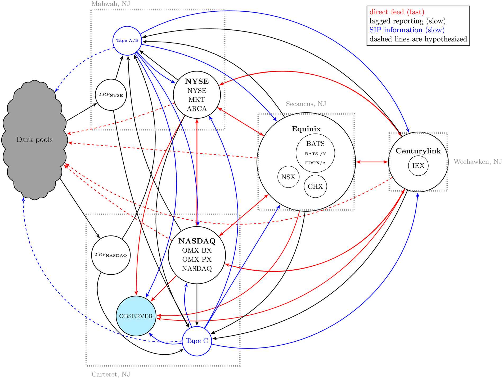
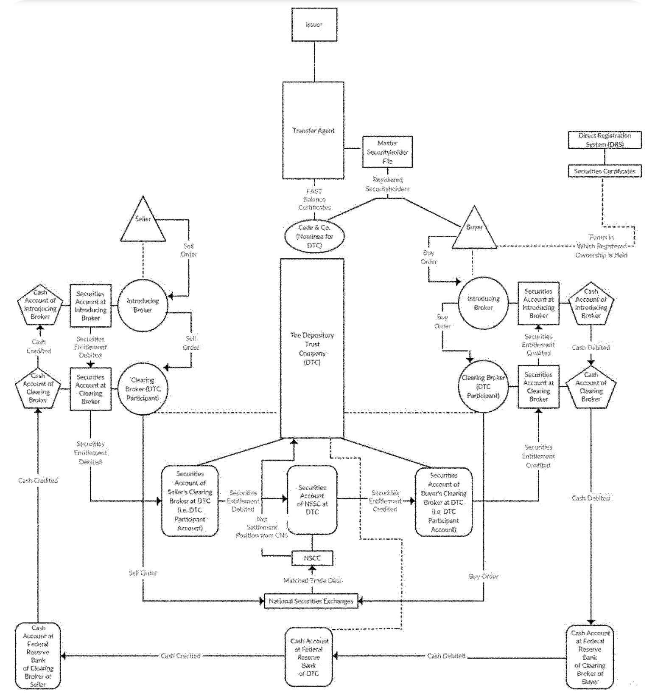
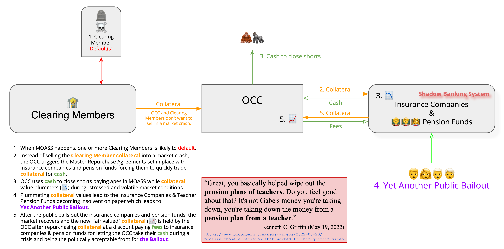

```
Originator: John Wooten <@JFWooten4>
Discussion: https://github.com/WhyDRS/SEC-Comments/discussions/14
Extends: https://www.sec.gov/comments/sr-occ-2024-001/srocc2024001-474471-1355754.pdf
Status: Community Review
  live: 18 May 2025
  file: SR-OCC-2025-801
  href: https://wooten.link/TAR1
```
<!-- please phrase `extends` starting extension as "My comments in re..."  -->

# Non-Letter Content

## Email

### Recipients

to: `rule-comments@sec.gov`

cc: `foiapa@sec.gov` (note for the Pollack Study as _Id._  to note 22 of 64 FR 57996) 

cc: `crypto@sec.gov`

bcc: `sean.dillon@mail.house.gov`

### Subject Line

Comments on File Number SR-OCC-2025-801

### Body

Hi,

The recent [executive order promoting innovations](https://www.whitehouse.gov/presidential-actions/2025/01/strengthening-american-leadership-in-digital-financial-technology/) asked our government to "identify all regulations, guidance documents, orders, or other items that affect the digital asset sector." Accordingly, we request a review of certain ownership exemptions under UCC Article 8 and transfer agent regulations in general. Transfer agents are the most direct means investors have for transacting in the market for stocks. Our National competitiveness in capital markets may depend on the regulations governing digital-asset providers of these services given a TAD.

We hope the new Crypto Task Force will consider rules directly protecting investor portfolios in the case of clearing agency insolvencies. Hopefully, an updated set of transfer agent governance will spur an innovative "market structure, oversight, consumer protection, and risk management" that empowers the Commission to protect an overlooked industry sector of increasing importance after the market events of four years ago, when several brokerages popular with retail elected to change access to certain securities to position close only without warning.

FOIA Services,

Please see request in note 24329.


In good faith,
[Name]
Member, WhyDRS

P.S. Crypto Task Force, these comments at nn. {{^CBDC}}, B, aNd C  relate to John's previous communication sent on Apr  30.
 
### tmp  discord  #generlawr reveiw annoucnemnt

## Document

### Addressee

Ms. Vanessa Countryman

Securities and Exchange Commission

100 F Street NE

Washington, DC 20549-1090

### Header

Federal Preemption of Challenges in U.C.C. Article 8

##  Terminus Narrative

- GME problems (brief)
- State law  flaws
- Intro FTDs
- Frame as  *centrality*  around other banking stories
- The  cvontrol problems in bankruptcies
- The profit motive throgh apex (leveragng too fines)
- DAs from DTC'sgreat collateral  theft
- Prgrammatic access to [This](https://www.youtube.com/watch?v=DW6L2rcEKJM)  ius a  veruy heavily -edited  video. Why  do you think it sis s oheacvily  edited?COinbase as aprallell
- 
- Control frame on systmets through  2006
- Proposed tri-party sys at n.17 https://www.govinfo.gov/content/pkg/FR-2025-02-26/pdf/2025-03071.pdf#page=2
   - explaining how  it's literally the DTC  system
   - go into the  cross-marginging and collateral
   - overview of interconntected cross-margiing
- Inadequate risk prep  via / per SIPC
- How  this is genrally unknown
  - ccat talk
  - crypto  rouidntbaling
  - pther agent outreach
- >>  Community as solution


# Letter

Dear ms. Countryman,

We  haveb een investigating the OCC's lqiuity  managemmnet plasns  for some time  now.[^start-reen-ieelds]i ahve great oncern over th eproposed amendments  as someone eeply  self-intersted in  the AMerican  financial  systme functioning[^occm] so that my fgranddparnets might enjoy their golen years without econmicc Protection.[^occm-d] Shhoul this operatioonal change come into effect, "the stability of the broader financial system"  could be placedat  gret  risk for self-seeking "execution of the facility on commercially acceptable terms."[^src]

I will  fully explain my  perspective here as condensly as  possible givne the present time contraints.[^timing] Gettingg these methodologie right means so muhh o me personally becaue I've seen  the pain they can cause invvestors. As an anectotal examle, might I share the investing story o  closefriend, Tim?

During the month of January 2021,  Tim had some of his last ew thousand dollars in Robinhood, invested inn naked GammeStop calls. With contracts expiring  JJan 29, he received a margin ccall three days before expiratoin via email. As  staff  understand,  a major event occured  two days later when large  swaths of  the industry  stopped investors from aquiring  shares or options contracts, limiting afccoutns  to position-close only (the "PCO event").[^pcco-intro]

Obviously , markets can't  function when  onlyy one side of transacttio nvvoum may be expressed throggh exchange.[^oi-token]  But Tim had a different problem with his OCC clearing  member.[^rh-occ-cleaing]  The margin call in question wa sent  as an inconspicuous "digital communication notice" reviewable upon loging into a brokerage system.

After  downloading the  PDF fromm a "secure site,"[^rh-cyber]  my  friend was told they needed to  deposit $50,000 withing 24 hours. At this opoint,  the position had an uncreasized gain of $60,000; Robiinhood was preparing Tim' sacunt to take ull delivery of the contracts' shares at expiration. unfortunaly, even  if  he had this money avlaaible, the preset financial systme  makes it very callenging for individuals to transfer large sums  of funds in short timeframes.[^bad-banks]

hhen Tim failed to immeiately feposit more than tne  times the initla cah in his accout, Rohbninhood liquidated  the position for only $5,000/. They justidfied this manipulative central action  by valueing the contracts  at the time of the margin-call  email. This resulted  in a substaintilly -differennt vauation from  the marketable secondary value of  the contracts when they were confiscated form his account  on January 28/.

Investors simply  shouldnt' need  to  watch  their brokers withdrawe their profits from their own account,  as happened to Tim in Feburuary. But this asset siezure is explcicitly  presently enabled by the ltter of the law  in all 50 states. Might the Commission consider superceediing these weak investor  ptoections through 15 U.S.C. § 78q-1(f)?


[^start-reen-ieelds]: _See  generally_ PREV  . capitalized phrases  or  acronyms largely defined  therein. The community at large greatly apprrciated  the Commission's diligence leading up  to hte oCC's withdrawel of porposed changes.

[^occm]: _See generally,_ my omments in esponse  to the incredible recent staff acctions  establishing a rhoust tehniccal filing interfacce, _available at_ https://www.sec.gov/comments/s7-15-23/s71523-301019-767522.pdf. 

[^occm-d]:  _Id._ at  § II.B.d.

[^src]: _See_ the advance release as adopted  in the  conformed filing in Exhibit 1A at  90 FR 10734–38, _available at_ https://www.govinfo.gov/content/pkg/FR-2025-02-26/pdf/2025-03071.pdf.  < !-- todo:  compare from here  adn  [X](https://www.sec.gov/files/rules/sro/occan/2025/34-102462.pdf) laterr  -->

[^timing]: I PPRECIate the  opporutnity  t o ccommmont on  this advancce noticce which was brought to ky  attention  by the community  slightly  over a week ago. Addditionally, our commmunity  review process added a few days of processing to ensure consensus on the views presented. _See_ _infra_ § 3 forr  a discussion of these implications after  the comment presents  material information related  to the consideration of this ticce..

[^pcco-intro]: _See generlly_ _infra_ § {{TODO: gme-congress-sec}}. Spewcoific  references are avlaible _infra_ notes {{^game-stopped}}, {{^staff-gme-study}}, and  {{^cong}}, _inter alia_. OCC itself recognized this sequence of events isch as in File No. SR-OCC-2024-014 (_available at_ the link privded _infra_ § {{^TODO_TERMINUSES_SEC}}) (the "SR-OCC-2024-014 Filing") at 14, stating that the corporation's management had to override the approved, tested, and automated margining methodologies.

[^oi-token]: _See, e.g.,_ collapse of a cryptocurrency which employeedd off-exchange market-=making deals to exclusively purchase outstanding digital assets, _available at_ https://youtube.com/clip/UgkxkjSFXLQtP9WnDp8Q7dd39_cGHwvosbaM.  While this exmaple showcases the invevitable  collapse of an articificlaly-inflated price, perhasp staff might concur that the events leading u p top the PCO event showcase the invevitable growht of a solvent corporation's shares after artificial deflation. Should the  OCC's margining  systems  facce risk of  WEall Street invsolvencies as contemplated in the SR-OCC-2024-014 Filing at 4?

[^rh-occ-cleaing]: Robinhood discloses thier  self-clearing  businessx affiliate in their Form  S-1 at  F-15, first Form  10-K at 24, and  even  the OCC lists  them as a  clearing  member  mid-way  throgh 2020;  _available at_ https://www.sec.gov/Archives/edgar/data/1783879/000162828021013318/robinhoods-1.htm, https://www.sec.gov/Archives/edgar/data/1783879/000178387922000044/hood-20211231.htm, and https://web.archive.org/web/20200701202545/https://www.theocc.com/Company-Information/Member-Directory ,respectively. As further  described _infra_ note {{^rh-clearing-self}}, the  company claiims these business practices amdde their service faster and more relaiable. indeed, presumably they had more ddiscresion  over Tim's position given theirr direct managemnt of ts risk exposure.

[^rh-cyber]: _See, e.g.,_ the  Commission's $45 million fine  for inadequate   data  security, electronic communciations, addn Reg  SHo reporting, _available at_ https://www.sec.gov/newsroom/press-releases/2025-5. Ms.  COuntryman,  your  excpetional order,  enabled  by exceptional  sta ff  efforts,  highlights  one  such  case  of gross cybersecurity  vulnerabilityies at ¶ 7. Later  in ¶¶ 74–79, the order explains  that  millions of  investors had  theirr  information stolen  in an attack prasctically  identical  to one such breach over three m onths prior which resulted in a secificcorrective action to  blcok  the type of software employed in the theft.

[^bad-banks]: _See, e.g.,_ _infra_ note SEC_TODO, highlghting challenges common indivul challenges akin to those  detauled

## Systemic Accounting Idiosyncratic Risks

The Commission has spent far too many  years taking massive efforts to reform our market's settlement failures.[^ostk-augi] Despite these great itentions, invretors just over four years aog saw unreccedented volaility in a parrticular security with xtremely high short inters.t After the run-up of said company, the founder of interacctive brokers apppeared on a major media platform[^intro-quote-date] to announce:

> We have come dangerously close to the collapse of the entire system.
>
> The rules, as they are today, [would require NSCC participants] to deliver to them [investors] 270 million shares, while only 50 million shares existed.
>
> There is a hole in the system that we immediately have to stop.
>
> — Thomas Peterffy

To ease this accumulated risk, staff know that clearing agencies historically faced stiff competition to timely settle outstanding transactions.[^historic-id] Indeed, it was precisely this market encouragement which I understand prompted DTC to beneficially dematerialize paper trading.[^dtcc-def] I would like to generally abstract away the convoluted National Market System ("NMS") settlement systems enabled by the DTCC,[^dtcc-def-1] the plethora of custodians participating in its clearing agencies, and the hundreds of intermediaries exchanging assets on top of its plumbing (a central "Custodial Structure").

Rather, I am concerned with the solvency of Cede & Co ("Cede"). For years we have looked into the nuances of the Custodial Structure, which ends in all terminuses at the behemoth partnership nominee. Thus, the hole in the system constantly rearing up through FTDs ultimately makes its way down to DTC's registered share of securities.

This is particularly concerning for me because "a creditor of the clearing corporation" in bankruptcy "has priority over the claims of entitlement holders."[^ucc-511c] Thus, investors could lose their portfolios should markets face a situation where "a clearing corporation does not have sufficient financial assets to satisfy both its obligations to entitlement holders" and its (participating) secured creditors.[^511c-id] I suspect these could be particularly devastating seizures given the interconnectedness staff fully understand in central clearing counterparty ("CCP") operations.[^ccp-connec]

At least a dozen States legislatures recently introduced proposed changes responding to control agreements common across securities loans.[^DTCcs] However, advocates received significant pushback from banking interests given such a "claim of a creditor of a securities intermediary... has priority over claims of the securities intermediary's entitlement holders."[^ucc-511b] Does the Commission support the right of investors to their own portfolios as a due property law?

Before joining the Commission, Commissioner Hester Peirce wrote that "the combination of clearing mandates, government prescriptions regarding clearinghouse design, and government support for CCPs threatens financial stability."[^csuohio] Later, the article contemplates strategies to decrease the likelihood of an emergency Federal-Reserve loan, citing at least three other CCP failures which would now mean "markets will not be able to function" in the Custodial Structure.[^peirce-failures] Ought we leave our entire capital market in the hands of one company?[^peirce-SUBTLE]

Luckily, transfer agents exist outside of these credit risks, acting as a safehaven for long-term investors who don't want exposure to securities lending, _inter alia_. Investors who own legal title to their own shares through a system for direct registration ("DRS") previously additionally received preferential treatment in cases where credit interests in the Custodial Structure were not clear.[^Dole]

I havem ade  material  efforts to intorudce a  new  sustainble  system  through  an  inter-agent Transfer Agent Deppository ("TAD"). Such  a  system  preeesently  allows  for the  accurate and prompt   settlment  of debit-based  securitires  transactions,  ameliorating the unwarrented  risks  centralized  in  the  Custodial  Strucutre.  Because  examination staff rteached  out at the end  opf  last  month to  discuss these  matters  further, I  will  not substantiabllyl  elaborate on  the secure  marketplace  function  of a TAD.

Notwithstanding,  I  do  hope  staff  ocnitnue  contemplating  blockchain  technolgoies  as  a  solution to the  inadequacies  of the  CUsotdial  Structure  highlighted  throughout.  The exceptional  work  of all COmmissioner's  leading  market-structure  change  seems  deeply  aligned  iwth  historic  juristprudence cfrom across the Nation.[^Dole-id]  IN reminsicing  over challenges with past  ocmmentors,[^leanord]  it's become clear that we  need  a new systme which  doesn't  require  the  antiquated security entitlements of yewsteryear's wall Street.


[^ostk-augi]: _See, e.g._ Commissioner Luis A. Aguilar's meeting addressing double-digit outstanding Failures to Deliver ("FTDs") when investors acquired a 120% ownership stake in a discount online retailer, _inter alia_, given the failures of central netting, _available at_ https://www.sec.gov/comments/s7-19-07/s71907-1436.pdf#page=3. _See also_ written remarks _infra_ note {{^Discord-GME}} from the CEO of such firm at the time, stating "a financial news organization suggests that of our approximate 6,000 owners, the top 50 own 106% of our stock" just before the share price halved.

[^dtcc-def]: DTC and DTCC defined _infra_ §2.3.

[^dtcc-def-1]: _Id._

[^ats-prep]: _See_ _supra_ note {{^ostk-augi}}. Given cryptosystems and decentralized exchanges allow these transactions without the possibility of FTDs, I asked Commissioner Aguilar and partners at their venture company about their interpretation of if they "would or would not consider a DEX to be an ATS" in a written communication on 26 Sep 2023 and subsequent meeting in relation to File No. S7-02-22, _inter alia_. If staff agree with the supportive remarks in these discussions and pro-digital-assets rhetoric espoused by our present governmental leadership, then might we need an oversight system for uncovered peer-to-peer distributed transaction messaging systems?

[^ats-note]: _See_ analysis of legacy liquidity venues in one of the leading academic finance journals, _available at_ https://doi.org/10.1017/S0022109017000849. _See also_ discussion of alternative liquidity-providing cryptosystems, _available at_ https://x.com/xximpod/status/1908527646331593078. I see no other decentralized free market than the one referenced _infra_ note {{^xlm-minimal-info}}.

[^intro-quote-date]: Based on extensive diligence, Mr. Peterffy's sentiments over the past few decades closely resemble this quote, _available at_ https://www.cnbc.com/2021/02/17/interactive-brokers-chairman-thomas-peterffy-on-gamestop-frenzy.html. _See, e.g.,_ departing remarks from Commissioner Aguilar emphasizing remarks from Mr. Peterffy that "our markets are in a 'crisis,' and that 'order, fair dealing, and trust' need to be restored" in § II ¶ 2, _available at_ https://www.sec.gov/newsroom/speeches-statements/us-equity-market-structure.

[^historic-id]: _See_ _supra_ note {{^best-eff-mon}}.

[^ucc-511c]: _See_ Uniform Commercial Code ("UCC") § 8-511(c), as presently adopted in all 50 States.

[^511c-id]: _Id._

[^ccp-connec]: _See, e.g.,_ last year's annual financial statements for NSCC, stating an approximately equivalent amount of assets and liabilities, _available at_ https://www.dtcc.com/-/media/Files/Downloads/legal/financials/2024/NSCC-Financial-Statements-Annual-2024.pdf#page=4. At 27, the report references the "multilateral netting contract and limited cross-guaranty agreement with DTC, FICC and OCC," a risk mutualizer further expanded by industry arrangements _infra_ note {{^ny-err-3}}. Could the failure of only one of these intermediaries cripple all of their interoperability?

[^DTCcs]: _See, e.g.,_ six formalized change requests just this year in NH HB427, ND SB2364, SD HB1122, TN HB443, CT HB5849, and WY SF189 (all 2025); _available at_ https://legiscan.com/NH/bill/HB427/2025, https://legiscan.com/ND/bill/SB2364/2025, https://legiscan.com/SD/bill/HB1122/2025, https://legiscan.com/TN/bill/HB0443/2025, https://legiscan.com/CT/bill/HB5849/2025, and https://legiscan.com/WY/bill/SF0189/2025, respectively. All these legislatures strike the exception to Main Street securities entitlement custody as discussed in the proposed bills. _See also_ proposition questioning testimony in the third bill, stating "all those clients in the teeth of the crisis had no access to their accounts... that happened to the retail investors; it happened to the biggest, most sophisticated investors in the world that were in Lehman Brothers—so, big and small. The small investors: those accounts were eventually sold to another firm. That is the only way they got access to their accounts again—it took some weeks and months. The institutional clients: unbeknownst to them, all of their Treasuries, which were their collateral—their dry powder to operate in this crisis—were taken by JPMorgan in the bankruptcy" as both the custodian and secured creditor for such assets given invocation of UCC Art. 8, _available at_ https://sdpb.sd.gov/sdpbpodcast/2025/hco15.mp3#t=5640.

[^ucc-511b]: _See_ UCC § 8-511(b), as presently adopted in all 50 States.

[^csuohio]: _See_ law-review article responding, _inter alia_, to perspectives on central order clearing from Treasury Secretary Jacob Lew and former Chair and Commissiolner Gary Gensler, _available at_ https://engagedscholarship.csuohio.edu/cgi/viewcontent.cgi?article=3915&context=clevstlrev. As cited in note 4, Commissioner Gensler investigated the failure of Long-Term Capital Management without finding "good answers" to stop the spread of contagion which later manifested into 2008. As staff know, File No. S7-23-22 later implemented a clearing mandate requiring more participant interaction which could involve substantial FICC risks.

[^peirce-failures]: _Id._ § II.F.

[^peirce-SUBTLE]: _See, e.g.,_ earlier work discussing the materiality of securities lending in the bailout of American International Group, _available at_ https://elischolar.library.yale.edu/cgi/viewcontent.cgi?article=10106&context=ypfs-documents. The paper concludes after extensively establishing that "securities-lending issues arose in regulated life-insurance companies" which needed the "discipline" of independent action, since "merely making sure that every entity has a regulator will not fix the financial markets." Might a more decentralized, localized, and autonomous strategic-planning market for organizational decisions best support the whole financial system as it rapidly evolves?

[^Dole]: _See, e.g.,_ investor class-action memorandum after an unfair management-led buyout, previously settled at a 20% premium over the original price, _available at_ https://courts.delaware.gov/Opinions/Download.aspx?id=252690. Shareholders held valid claims against 49,164,415 shares which "substantially exceeded the 36,793,758 shares" available. While DRS investors received the full award amount, it is questionable whether all beneficial holders received due compensation through the custodial structure. The funds were sent to all record holders, but clearly some class members would need to receive reimbursement from a fraction of their holdings since Cede was the only registered owner which could create more share entitlements than true shares.

[^Dole-id]: _Id._ n.1. Vice Chancellor J. Travis Laster  laments the "top-down federal solution"  rushed  out  after  th e  Peapeorwork  Crisis,  highlighting the  nedw opporutnityh  where "[d]istributed ledger technology offers a potential technological solution"  for "a single and comprehensive stock ownership ledger."  WE've  fdeveloped  such a  tehcnololgy  from a grassroots open-source  communtiy further  described  _infra_ § III

[^buffett-drs]: For instance, Warren Buffett once wrote that investors should "be sure to have your stock registered in your name" after failing to  receive  sharheodler donation requests from entitelment holders, _available at_ https://www.berkshirehathaway.com/letters/1981.html. IN  this  charitable  act  to  donate  corporate profits to nonprofit causes, it  took berkshire's largest brokekr three weeks to froward the notice despite bikling "for mailing services within six days of that belated and ineffectual action." _See also_ remarks from Commissioner Peirce supporting blockchain technologies as a solution to the convoluted securityholder communication structure present in the Custodial Structure, _available at_ https://youtu.be/6wUzE9ynIjI.  Might  a  new digital, verifiable, open proxy systme through transfer agents best keep investors connectored to the issueers they  support?

[^leanord]: _See, e.g.,_ concerns  of  Leonard W. Burningham, Esq.  over  innacurate securities deliveries which perpetuate in today's markets, _available at_ https://www.sec.gov/files/rules/sro/dtc200302/lwburningham032203.txt. IN orally disucssing  the adverse  claims problems raised a nd  case  parties, it was  apparent last week  that  mcuh  of  this  knowledge and reccolation  has been lost  to time,  as  I'm  sure could undserstandbly  happen with  hardworkign staff.  But  I will  poutline _infra_ §  2 how  the markets  are getting  more and m ore incterconnected  as feared  by refulatrors,  and thus  the  problkems  of perfected  interests  in UCC  § 8-115  can materially  harm invvestors.


### Glaring  Legacy Accounting Inaccuracies


Our derivatives, banking, and financial system seem tightly intertwined with the Custodial Structure. Given my concerns over the stability of this system, justified by rulemaking last year,[^wind-down-rule] I would like to discuss the downstream implications of an overreliance on a select few protocols. These can be open standards or proprietary corporate operations, ultimately leading to a concentration of risk for all investors given any operational breakdowns.

Today's financial systems evolved by necessity from an antiquated paperwork-based system. As an anecdotal matter of example, my partner recently cashed in a few thousand dollars' worth of Series EE bonds in certificate form. Given our proximity to deposit-taking institutions open for our business outside of her busy working schedule, we drove over an hour to a nearby bank. We would need to make a similar trip to obtain a legacy medallion signature guarantee, as I understand the services of this particular banking business.

Once we arrived, it took at least three hours to deposit all of the bonds despite the fact that nobody else was in front of us in the teller line. First, my partner manually signed each of the paper slips representing a bond. Secondly, she gave the teller her Social Security number and address, both of which were on file with the institution. Then, we stood for hours while the gracious teller manually keyed in data about each of the individual bonds. Repeatedly during the exchange, they told us that a single keystroke error would invalidate the entire manual entry process, requiring slow and methodical data entry while a line amassed in the lobby for other tellers unable to help due to the nature of the computer security system.

Two months after this interaction, my partner received a letter on January 6, stating a savings bond "was redeemed for an incorrect amount." The actual amount redeemed was 40% less than originally credited, resulting in a deduction which overdrafted her account as $100 previously withdrawn turned into $59.76. The message was signed by the name "SSS" from the bank's "Centralized Operations." Does the Commission believe our financial system should rely on processes so routinely prone to human error?


[^wind-down-rule]: _See_ File No. S7-10-23 as came into effect just this January, _available at_ https://www.sec.gov/files/rules/final/2024/34-101446.pdf. The policy change addresses how the Custodial Structure "can pose systemic risk to the financial system" given participants "concentrate risk in the clearing agency." Staff at 119 go so far as to say that "contagion events that could pose a systemic danger to the U.S. financial system." I appreciate the Commission's active role in attempting to mitigate these unnecessary risks, which DTCC itself claims are impossible to expunge at note 441.

#### More Shares Than Exist

Unfortunately,  Wall Street's system  of  rehypothecation  rroutinely  "expands"  the ottla number of shares floating in the market, akin to a bank lending our more dollars than in its reserves./ Thuss was note legally  possible before  the 1994 amendments  to the UCC, as investors throug securities intemrediares had a hidred prperty interest in their protfolios.[^ucc-study-infr-prop]  hOwever,  staff themselves readily  disclose[^staff-shorting-infra] now that:

> Short interest can exceed 100%—as it did with GME—when the same shares are lent multiple times by successive purchasers. If someone purchases a stock from a short seller and subsequently lends the stock out again, it will appear as if the stock was sold short twice for the purpose of the short interest calculation.

<!-- TODO
> 
> for any given moment in time, one security can be attributed to multiple financial transactions


https://www.federalreserve.gov/econres/notes/feds-notes/ins-and-outs-of-collateral-re-use-20181221.html

-->

This isonly possible bcause of the fungablity  of omnibus shartes conceenrtradted udner the singular hands of Cede. Frankly , there have been too many  exxamples of public record discrepencies to warrant  material substantiation in rleation to its impact on OCC's margiing operations.[^eg-naked-shorts-later] One other prominnet recent exampple  of thesee factual innacuracie can be trivially  found i the bankruptcy of an issuer popular with individual investors went bankrupt two years ago with a disproportionate proposition of shares outstanding compared to those held under the Custodial Structure according to centralized FAST declarative ownership data.

This fate is all too  common for firms alledging fwrongoing oon behalf of the Custodial Structure. Briefly, the firm  declared  Chapter  11  on April 23 2023,  amd its bankruptcy documents two weeks late showed Cede  as owning 776,404,408 common shares.[^bbby-case] However, the issuer's books and records at the transfer agent recorded only 739,056,836 shares outstanding four days after the bankruptcy capitalization table,
 
Thus, it would be impossible for all Cede claimants to bear rights to common stock in this enterprise. Given these same clearing members ar the general partificpants at the OCC, I see the same inaqueate _pro rate_ rights challenge in the event of member insolvency.  Namey, how can all Wall Street firms remain  solvent if they collectively holdd more entitlements to shares  than exist?


[^ucc-study-infr-prop]: _See_ _infra_ note {{^st-john-ucc}} at 624. in the  entenc just before § III on Systemic Risk, Facciolo explains how "Article 8 creates a new type of property interest that 'is not a claim to a specific identifiable thing; [rather] it is a package of rights and interests that a person has against the person's securities intermediary and the property held by the intermediary.'" He makes thiis staemnet with dreference to the  UCC adoption  comments at § 8-503(d) whicch clearly state entitlemmnts ome without  common-law property  rights as "Article 8 also contains general adverse claim cut-off rules for the indirect holding system."

[^staff-shorting-infra]: _See_ _infra_ note {{^staff-gme-study}} n.75.

[^eg-naked-shorts-later]: _See, e.g.,_ _infra_ note {{^other-3-ex}}

[^bbby-case]: _See_ llit ofg equity srurtyholders under bankruptcy code, _available at_ https://wooten.link/kroll-cede at 8. Cede's equity holddiings are listed in dupliccate, which we found particualrly  strangee in ddisucssion  of anoyhte securityty with this clerical pheonmenon, _available at_ https://x.com/JFWooten4/status/1753471580842209390.

[^bbby-sec]: _See_ Form 10-K filed the next quarter, _available at_ https://www.sec.gov/Archives/edgar/data/886158/000088615823000059/bbby-20230225.htm. At 2, the  document reads: "The number of shares outstanding of the registrant’s common stock (par value $0.01 per share) at May 9, 2023: 739,056,836."


# high-0levle  of the  waterfall  and  tear-upis from 4–7
https://www.theocc.com/getmedia/e8792e3c-8802-4f5d-bef2-ada408ed1d96/default-rules-and-procedures.pdf


## nuanaced  tear-up documentation
https://www.sec.gov/files/rules/sro/occ-an/2018/34-82514.pdf#page=24.26
https://www.sec.gov/files/rules/sro/occ-an/2018/34-82514.pdf#page=18.61 (also mentionns the onbank vneue )

## occ  choicess  for  procytclical treamtent
https://www.sec.gov/files/rules/sro/occ/2024/34-99393.pdf#page=4


# likely unceecesary

## manua lmargin again,  largely  covered  already
https://www.reddit.com/r/Superstonk/comments/1ae0toi/occ_proposes_reducing_margin_requirements_to/


#### Equivalnet Outstanding Custodial Mishandling

In disucssing tjese innacuratries with egnineers at CCPs,[^dtc-eng-chat] I've become doubtful off their ability to  reconcile the FTD issue. I believe re ent events support this line of thingking,[^ftd-foia] whcih onyl  exist  because a trusted central  actor  like the OCC determines accunt  balances  in a single ccentralized  ledger prone to  corrurption./  Can  we  do  better, so that  all market  participants play o the  same field when analyzing material infformation such as the margigin balancces  of clearing  members?

THe  oCC  falls squarely  in  this  same risk  ccentralirtyy  provision, whicch I found abundantly  apparent  from the remarks of the  Deputy Governor for Financial Stability at the Bank of England in an FDIC meeting:[^bailout-chat]

> [T]here's very little CCP skin in the game when the losses are mutualized.
> 
> ...the CCP rule book means it can effectively wind itself up without bankruptcy. The latter stages of that waterfall process could be systemically very damaging in the allocation of losses across the wider financial system.
>
> — Jon Cunliffe

Given the extrmee   ompexity  of trading systems  in the  cUsotidal Structure  pre-CCP  clearing, i have  to  believe  that regulators will fae an impossible task of uncovering an early failure event. If this goes awry like before, there doesn't seem to be very  muh we can ddo to save legqacy credit systmes. distubringgly,  past incicdents  ere directly  sidestepped by CCPs through mnaual risk takeovers wich overrode margining rules  at the risk of the financial system.[^peeter-intro-supra]

the  uRopean Union noticed  htese  risks two decades ago  when they  put together a  Clearing and Settlement Legal Certainty Group  to ask the   Dederal Reserve  Bank of New  York 58 questiopns about the neww clearing ownerhsip system under Artiel 8.[^certainty] As made abundandtly  cclear  by David Rodgfers Webb, the point of this exchhange was  to establish  clegla  certainty  not for invesotrs ,  but for  secured creditors of financial intermediaries  relying on posted  customer  assets  lent t benkers.[^great-taking] While we will dive into the ownerhip implcciationsx of these ruling intertrepatinos in the next section, I  find  them parmount to introduce n ow since  all of  today's  coplex interrelated systems base their operations  on this assumption that one dcentral depository can  manage  the control records o f all participants  given legal title  ot  securities.

Oe synmprotm of this  central  control over  collateral  has been  the competition and gfragmentation of trading venues, largely  for the benefit of  Wall Street  firms seekign price improvement from public info:[^fragmentation-img]



Given  there  are  ,pre matopma; excjamges tramsactomg om p[rtaopms  amd  mo SIP  price feeds,   options have an even greater decree of varipos ccomplexities which can create  hidden  system risks.[^married-puts] pReviosuly,  CCPs  have  responseded to  increased margin  demands by waiving algorthmic riddk deposits.[^occ-waiving] Might we consider breifly  the  operational power  placed  in the hands o fz a  Timothy Cuddihy?[^TimothyCuddihy]

An exccample of "insider activities"  and centralirtyy emmerged  when  Robinhood received a  $3.7 billion  margin  call despite only  having acess  capital of $0.7 billion. Somehow , the firm made it through  this  day  thanks  to  the sort  of beurocratic deference now afforded  to  OCC clearing members.[^occ-efs] As the  Commission  knows, the House Committee on Financial Services found that the largest components of this collateral requirement included a Value-at-Risk ("VaR") charge of approximately $1.3 billion and an Excess Capital Premium ("ECP") charge of $2.2 billion.[^rh-margin-claims]

Over  the two  busness days after this assessed charge, Robinhood had to  reach  out  ot Sand Hill to raise over $3.4 billion.[^cap-rais-erh] In remarkign on the  "apparent" public model releaed  by the NSCC, the firm's CEO  mimiced it's Head of DData  Sccience in calling collateral charges  a black box.[^blackbox-nsccc]


As the Commission knows, the broker's $3.7 billion obligation to the Custodial Structure placed the intermediary at risk for insolvency given their $700 million in free collateralizable assets.[^staff-gme-study-BUTNOTSETUPYET-TODO] Accordingly, such Regime members, without public review or comment, elected to decrease obligations by $2 billion,[^rh-arg-main] an amount of money available by means of emergency Wall Street fundraising, quite possibly placing the stability of the entire financial system at stake. Should we trust our most meaningful periods of market volatility such as Trade 385 in the hands of systems subject to fat-fingering or human-processing errors?


Vlad says only raised $2 billion VC beforehand and mentions "a little bit of an opaque formula" when discussing the VaR formula, which "is not fully transparent" and "there are ways to reverse-engineer it, but it's not, kind of, publicly shared. And then there's a special component which is discretionary, so that kind of acts as a multiplier." 

Musk: "Discretionary meaning, it's just their opinion?"  
Vlad: "Yeah..."

"Four years ago" part: https://youtube.com/clip/UgkxaLZNPl1Bby-1VVJ2ex4NLr4yZjRdzO4k


Might we follow in the current Administration's objective "to maintain self-custody of digital assets" which are ou familiar securities themselves?[^DA-EO] --just after reading through this, thinking it may be handy to add a small disclaimer to the already effective section at the top trying to draw the line between views which represent the collective and those which are personal. Something that shouldn't need to be said but perhaps still could be considering how new the concept of a DUNA is--


In accordance with this Executive interest in sectors related to support "stability of the financial system, individual privacy, and the sovereignty of the United States," I find it meaningful to consider the Congressional implications[^cede-fail] of a shift towards decentralization.


The DTCC itself admits that the Custodial Structure itself "cannot fuaruntee that their orderly wind-down will not cause contagion within the financial syusten or that the stability of the U.S. financial system will not be impacted."[^dtc-smac-1]

In another filing, they also arges afginast increasing reisk analysis of CCP Regume operations by service provieers such as their own matching subsidiary grantedexemption from registration as a clearing agency.


As shown by a publication on the day thereof, _available at_ https://www.benzinga.com/news/21/01/19376058/heres-which-brokerages-platforms-have-blocked-trading-in-volatile-stocks, this contagion spread beyond a systemic central routing agency, an intermediary staff identified in the report at _infra_ note {{^staff-gme-study}} <-- throw in somehwere prior with a page at Z>}}, which increasingly serves "younger investors and smaller accounts" as described at note 31 thereof. [Question circa "shoudl we rallyl burden our neweest and most vulnerable investors to the whims of xyz centralizyu as per comoiundign ngegatives]? Fairly simple to connect to the three-hour outage at clearing v. the all-day event at brokers." 

and then at the bezinga _Id._ we have "the clearing firms are not that well-capitalized" from Webull CEO (prob cite his intervieew somehwere)
- main https://youtu.be/4RS4JIEVyXM?feature=shared&t=751
- supp https://www.youtube.com/watch?v=Hkuz_T-muwI (less ideal facure)
- cross https://finance.yahoo.com/video/heres-why-robinhood-restricting-users-173049721.html

clearly not everyone , thus a select undercaptialization and large extent towards apex
https://www.reddit.com/r/stocks/comments/l8rhr3/weekend_gme_thread_homework_for_all_lets_stop/


Etrade does its own routing


[^rh-arg-main]: _Id._ Although the staff writers chose not to mention this particular bnroker by name in the last complete sentence at 31, NSCC's margin cll to theri routing broker was well publicized before being personaly negotitated yo a sum nearly hafl the original estimate vis-à-vi the ECP-charge weaiver. WHoistlically, this page of the report states total clearing margin across all brokers increased by about 37% in a single day. How can trading in a small handful of retail securities so greatrly disrupt the operations of our great Nation's onyl equities clearing firm?


[^DA-EO]: _See_ E.O. 14178, where our great President decreed: "the policy of my Administration to support the responsible growth and use of digital assets, blockchain technology, and related technologies across all sectors of the economy" despite surely fighting through traumatic pushback, _available at_ https://www.whitehouse.gov/presidential-actions/2025/01/strengthening-american-leadership-in-digital-financial-technology.

[^cede-fail]: _See, e.g.,_ recent fuyleaming in File No. S7-10-23 contemplating the failure of the Custodial Structure, _available at_ https://www.sec.gov/files/rules/final/2024/34-101446.pdf. Naemyl, the fifth paper cited in note 475 states, "Pervasive reforms of derivatives markets following 2008 are, in effect, unfinished business; the systemic risk of CCPs has been exacerbated and left unaddressed." Its subtitle claims the CCP is "too important to fail" and its author later writes that "their failure would have such a negative impact on the financial system and the economy as a whole that the government would do whatever it takes to prevent such a failure, including effecting transfers from taxpayers." Does the Commission believe _another_ Federal baloit of Wall Street's mistakes should take preference over grassroots nonprofit investor-centric innovations?
^^ same was WDR

[^dtc-smac-1]: https://www.sec.gov/comments/s7-10-23/s71023-225519-472762.pdf#page=2. Later states that it would be unduly difficult to ensure "there will be continuation of services by service profviders" requisite to the Custodial Structure's operations (at 8). - let's expand this to their comments on cloud providers given inadequate central infrastructure (JEsus christ  I swear their modernization memo is integrating Lambda)
^note 27 goes through bankruptcy proceedings
"RWPs are often implemented during times of market stress, and often during these times, circumstances are changing, and decisions are being made quickly." at 13 - also: "DTCC encourages the Commission to internally prepare and be in a proactive position to receive, consider, and approve any necessary regulatory requests from CCAs in a timely manner when RWPs have been implemented." 😲 jesus christ it's a literal blackmail

[^dtc-smac-2]: https://www.sec.gov/comments/s7-07-23/s70723-202219-405182.pdf#page=6. _See also_ ITP exempoting order note 24 which asserts that almost a full half of comments "urged the Commission to ensure that no entity improperly gains a monopoly on any aspect of trade processing" from firms such as JPMorgan Chase, Goldman Sachs, UBS Warburg, Deutsche Bank, Merrill Lynch, and State Street; _available at_ https://www.govinfo.gov/content/pkg/FR-2001-04-23/pdf/01-9962.pdf#page=3. In note 21, this document also suggests that the indsutry will shorten the settlement cycle to T+1 by a deadline over two decades ago.
**holy shit bro n.40 also falls uynder Clinton in the antitrust oversight of fucking ITP review !!!**

[^dtc-eng-chat]: _See, e.g.,_ notes from conversatino with DTCC engineer  detailign  post-trade failure-to-deliver operting flows, _available at_ https://github.com/orgs/WhyDRS/discussions/1 n.10  link  3. I was particualry  concerned with  the  docuemented u se of CSV  files  at  2, reconsciled through  am anual  end-of-day  batch  process reminiscent of  1970s  mainframe  technolgoies. I saw similar pattern aemmerge in  the  conversation  at 6  as error-prone manual reconciliation resolution was  pushed from Cede's books to clearing members.

[^ftd-foia]: _See, e.g.,_ changin staff  data positions related  to t he responses to  25-00185-FOIA, suggesting  that  certain FTD information woudld harm market integrity. In speakign with the author of this erequest, it's become clear that the'yve  been patiently wiating  for answers lasst year because of a true ccare for market integrity. _relvantly_, incomplete data  from the few central providers such as  _Id._ have  historically  failed to deliver  prompt and adccurate informmation to he t Commission  itself when  ehavily-shorted securities are  in question.  _See, e.g.,_ a memorandum  froom the Office of Econmicc Analysis at  note 1, stating that  staff did not revceive significant daily  FTD  information held by NSCC all  the  way  back in 2006, _available at_ https://www.sec.gov/spotlight/failstodeliver082106.pdf.

[^bailout-chat]: _See_  Systemic Resolution Advisory Committee under the Division of Complex Institution Supervision and Resolution, with  Cunliffe's discussion starting at the thimestamp, _available at_  https://youtu.be/0PtULsOtI2o?t=9311. Gvien "non-default losses could therefore wipe out the capital of the CCP and lead it to insolvency,"  I  find it extremely  questionable  that the OCC desired to  expand itt's emergency-resolution  repurchasing parties to nonb-nbank liquidity  procidors. We are almost facing the ultimate question of who should pay for Wall Street's massive procycliccal losses.

[^peeter-intro-supra]: _See_ _supra_ note {{^intro-quote-date}}. 

[^certainty]: _See_ Financial Services Policy and Financial Markets questionanaire  cop[leted  by the  legal  team  of American's top  central banksers, _available at_ https://archive.org/details/ec-clearing-questionnaire.

[^great-taking]: _See_ Webb's book specifically  detailing the ins and outs of prepty-right dchallenges, _available at_ https://thegreattaking.com.

[^fragmentation-img]: _See, e.g._ wokr from The MITRE Corp., Tyler Gray, Brendan Tivnan, and Christopher Danforth reproduced under [CC BY 4.0](https://creativecommons.org/licenses/by/4.0/), _available at_ https://doi.org/10.1371/journal.pone.0226968. Many of  the eleven esteemed authors therof rprsetn two established American unitversiites, and seven of them are affiliatged  with a 501(c)(3) established to advance national security and serve the public interest. Their findings revea over  $160 millikon of arbitrage progfits tstmming from latengcy ies between  tthe  complex exchanges routes, securities i nformation processorts ("SIP"),  and direct geogrphical feeds/.

[^married-puts]: _See, e.g.,_ use of married puts amongst  a select  few  market particiants  tio oruoirtedky  extend  their levergaaged  borrowings against a certain issu, _available at_  https://www.reddit.com/r/GME/comments/mgj0j1/the_naked_shorting_scam_revealed_lending_of,  https://www.reddit.com/r/Superstonk/comments/oenvoh/peekaboo_i_see_103m_hidden_shorts_part_deux, and https://www.reddit.com/r/GME/comments/mi8mo9/legal_interpretation_of_the_proposed_srdtc2021005. THe last post specifically  introduces the communtiyty  to material further explored  _infra_ note {{^occ-dtcc-plerdgingb}},  allowing  FTd reserts  through  the  collateral  loan  program duly adopted  in  the related SRO change.  While the amendment seems  tog attmept  forced underlying delivery  between  the DTC  and OCC,   it also  directly  detracts from clkearing memebrss;' avaliable margin deposits  during sustpension.

[^occ-waiving]: _See, e.g.,_ amentments  to  OCCs recover and ordery wind-down pllan which  increase reliance  on  human  jusdgmmenet at the  expense of  acctual margining algorithsms, _available at_ https://www.sec.gov/files/rules/sro/occ/2023/34-97785.pdf. "Rather than rely on a few of many possible events that could trigger a wind-down, the proposed revisions to the RWD Plan would move to a single WDP Trigger Event based on a determination by OCC's Board of Directors[,]" rreads the approved release at 13. Should we trust the  self-interested boardrooms  of Wall Street with the  solvent function  of  our financial  system  over and above p;rroven algorthmic margins systems designed by at least dozens of staff engineers?

[^occ-efs]: _See_ thje SR-OCC-2024-014 Filing,  n.42  (explaining  how  a beoricratic Model Risk Working Group can mnaually  tune margigin system weights  during hightened volatility, which proved detrimental in premmpting risks in PREV §  II.C.3).  Two footnotesd later, the OCC clairifdies that this  committe's  judjment overrode an algorithm with "more than 200 individual risk factors" for periods of up  to 190 days,  a length of time certainly  far  enough  to drawft capital indadequancies seen in PREV  § II.A.b. Lately,. so many of  OCC's ruile changes  as k for a n operational deference to management  (and redact key  margining information) that I wonder  if  their CCP even plans to rely  on  GARCH zshould a crisis  arise.

[^TimothyCuddihy]: _See_ _infra_ note {{^hidden-errs}},  placing billions of ollars in unilateral waivers in the deciding hands of one person. As staff k now, these waivers were the difference between intra-day  solvency fror  a  broker-dealer who intentionally chose  to  hand their own clearing  (adnd the associated risks)  to promote business efficinecy _infra_ note {{^rh-clearing-self}}. Should  a firm not bear  the conomic consequences of taking on increased risk in the financial  system  to "eliminate [internalized] fees[?]"

[^rh-margin-claims]: _See_ _infra_ note {{^game-stopped}} at 20. THe subsubsection  immediatly  proceeding these disclosures explains how Robinhood leadership intentionally  declined to proepr;yl  model  the  week's margin requirements leading up to t he PCO event . Just b efore this finding,  House staff find that thefirms Head of Data Science did not bother reading  the public formula for calculating collateral charges, and afterh th PCO event they  simply resolved to using  "Excel spreadsheets to model its NSCC collateral charge" like a legacy transfer agnt trackign shares.

[^cap-rais-erh]: _See_ first  cpaital  riase  of over a billion dollars the  very next day thrrough convertile notes from existin g backers in an  "emergency infusion,", _available at_ https://www.reuters.com/article/business/robinhood-raises-1-billion-of-fresh-funding-from-existing-investors-idUSKBN29X2ZN.  _See also_  second raise of $2.4  billion in another  convertible-debt raie priced about a quarter below  the IPO  price sold  to the public  five monthslater, _available at_ https://www.reuters.com/business/finance/robinhood-raises-another-24-bln-funds-investors-2021-02-01. All  this centralized  risk-sseeking  cusupport  came  at a profound  time in  capital markets,  and it  now seems the oCC  wants  a gaunrteed buyer of  its own member  defficincies  for the  next   crisis, thoghtfully soruced at money-market rates. Notably,  Robinhood completed  these investments one day  before the  DTCC's ECP excemption ended, but can  we really preidct when the  next market  downturn will  conclude?

[^blackbox-nsccc]: _See_ _supra_ note {{^rh-margin-claims}} nn.60 and 124–127.  _See also_ excchagne between Vladimir Tenev and Elon Musk the day after the  PCO  event, _available at_ https://www.youtube.com/clip/UgkxaLZNPl1Bby-1VVJ2ex4NLr4yZjRdzO4k.

[11111]: _Id._  Valaddamir says they have ""no reason to believe" CItadel is  in charge of the DTCC. THis  claim  makes sense at the time  given the market-maker was not on Board then,  as ttested  by public disclosree, _available at_  https://web.archive.org/web/20210201075846/https://www.dtcc.com/about/leadership/board. However,  by  June of  that same year a citadel eemployee  was added to  DTCC's  Board and  rremains  there to this day, with the original modification at thierr public site, _available at_ https://web.archive.org/web/20210610132842/https://www.dtcc.com/about/leadership/board. In _supra_ note {{^bailout-chat}}  at 3:12:00, Cunliffe  states six monthgs later that clearing members "don't have kind of enough influence on the CCPs;"  do  staff  share this  view?

_See_ _supra_ note {{^bailout-chat}}, _infra_ § 2, and advance noteice at n.17. Shoudl the OCC really have access to large institutional money market funds if "we're going to be in a pretty heavy systemic crisis" where  "a reservoir of pre-funded resources that can be accessed only in resolution might be necessary to enable CCP clearing service to continue to operate[?]" These are not unknown foreign risks whicch clearing members themselves are unaware of , so why then can these firms not deal with the risk managfment themselves if  "[w]hen you talk to the clearing members at very senior levels, they say they're worried about the risk in CCPs and the fact that they are exposed to these risks, both the mutualized default and the non-default[?]" Cuunliffe  goes ton to explain  the  conflict of  itnerests between clearing members minimizing  trade execution costs while having less direct influence over the CCP  than iddeal.


####


### Continued Daily Manual Processes

In reviewing the operations of central custodians over the past year, I've been remarkably distraught by the level of manual human involvement and judgment present in margining calculations. Because of these thoughts, I requested staff share with our community and the public at large certain particularly hazardous methodology changes at a clearing firm and SRO last year.[^my-req] Unfortunately, I have not been able to receive this information, especially  as OCC tightens  down on its public efencce of whyu material submitted fall undr an exempution from publicaiiton, which makes it more challenging to adequately examine detailed operationsal changes.

From this and many other events, some in our community interpret systemic underlying risks presented by the manual involvement of so many settlement middlemen. These concerns range from simple interfacing errors[^ex-intro-mm] to deeper quandaries over unpunished recurring erratic behavior from intermediaries such as Apex Clearing Corporation ("Apex") which influence the business of so many broker-dealers.[^apex-sec-ipo] Influence which quite directly but drastically unnecessarily forced brokers to deem retail investor accounts position close only ("PCO"), without warning, for a specific subset of securities.[^apex-sec-ex99]


[^my-req]: _See_ request  24-01211-E  from  note 120 of PREV.  I  called  both the  public FOIA office and  th4e research specialist assigned  ot the request  case  at least thrree times.  Gvioen the request was pblicly  acknowledged as properly  formatted, do staff believe I should reach  out to the  Office of Government Information Services for the third time?

[^ex-intro-mm]: _See, e.g.,_ recent remarks in response to an alert that a particular security was worth many thousands of dollars per share, despite the reality that it is presently valued at a small fraction thereof, _available at_ https://x.com/Python0o/status/1890464983445545037. _See also_ derivative products _supra_ note {{^rh-fractional-filings}} which attained this level of price action for some investors before transactional capability was unilaterally revoked from tens of millions of investors at over 150 broker-dealers, _available at_ https://www.reddit.com/r/Superstonk/comments/12gjugb/fractional_gme_shares_were_selling_for_512450_per. While some of these events may be attributable to human error, as was the case of the bank teller, others seem more inexplicably linked to the opaque operations of certain systemic industry participants.

[^apex-sec-ipo]: As the Commission knows, Apex attempted to go public through a $4.7 billion post-money reverse merger four years ago through its former parent Apex Clearing Holdings LLC, as detailed in a Form 425 filing from the acquirer, _available at_ https://www.sec.gov/Archives/edgar/data/1834518/000119312521049864/0001193125-21-049864-index.htm. However, the purchase and subsequent PIPE financings fell through after the incidents of late January that year. Exhibit 99.1 therein boasts about Apex's "over 200 clients representing more than 13 million customer accounts" which generated an "[i]ndustry leading" prior-year "operating revenue of approximately $236 million" at nearly 40% gross margins.

[^apex-sec-ex99]: _See_ business management claims highlighting profits in Exhibit 99.1 as attached to the February 2021 SPAC 8-K, _available at_ https://www.sec.gov/Archives/edgar/data/1834518/000119312521049864/d137294dex991.htm. While generously ignoring the market-shaking events of three weeks prior, President Tricia Rothschild says order routing "is a high cost of failure business, and our clients and their customers depend on Apex to safeguard their assets." Ms. Rothschild quietly resigned five months after this filing, before the merger fell through, as shown through a very short note at the end of a hiring announcement, _available at_ https://www.businesswire.com/news/home/202107060053

#### Block Trade Processing

As staff know, large institutions frequently trade outside of general public markets for their own business purposes. Indeed, dozens of such alternative trading venues run by corporations register with the Commission. The first of which was established 56 years ago during the Paperwork Crisis, three decades before official regulation defining the investor protections necessary from such business ventures.

In a House Financial Services Committee hearing last year, industry participants claimed that the Custodial Structure has moved on to much more automated systems.[^structure-hearing] "Before this transformation, the average person could easily understand how they functioned," said one representative from a broker and investment bank.[^Schack-testimony] When discussing the 1990s, Mr. Schack also wrote that the contraction market "mostly was manual and slow, with heavy human intervention."[^Schack-written]

Intermediaries like Apex stand central to this complexity and stand to financially benefit from its vast discoordination, despite best efforts from staff. Even the firm of this speaker "chose to access markets through larger rivals" due to the cost of "membership fees, direct market-data feeds and telecommunications connectivity" associated with the generally-private ventures which run these services.[^Schack-id-fees] Thus, we see added efficiency in the strict sense of comparing operations today to those from sixty years ago, but the market also congregates around a select few central bottlenecks and points of failure.

We appreciate the Commission's attempts to mitigate these risks in recent rulemaking.[^doub-back] Controlling the legacy Custodial Structure so far has been a momentous feat showcasing staff perseverance, attention to detail, and undying dedication to public service. Sometimes I have to stop and ask myself, "will the SEC ever stop working until all stock trading is truly free?"


[^structure-hearing]: _See_ memorandum from Republican Representatives, _available at_ https://docs.house.gov/meetings/BA/BA16/20240627/117468/HHRG-118-BA16-20240627-SD002.pdf. Employees from two national securities exchanges, _inter alia_, discuss the 1975 Exchange Act amendments and subsequent structural reform initiatives which prefaced the monopolization of post-trade clearing and settlement _infra_ note {{^note-DTC-2006}}. The House description details proposed and prior changes by Commissioner Gensler as attempting to "overhaul certain aspects of the market." However, the written testimonies of both the sitting academic and Nasdaq EVP reference or are themselves supportive studies paid for by the industry.

[^Schack-testimony]: _See_ Congressional testimony of Justin Schack from an intermediary which claims to be the industry's largest floor broker, _available at_ https://youtu.be/LxgQSA0htv8&t=5060. While not an independent, unbiased witness, they capture the peculiar development of the present unchallenged market structure when calling it "lightning fast, vastly fragmented, and extraordinarily complex. No one with a blank slate would design such a complex system to achieve such a simple task."

[^Schack-written]: _See_ Mr. Schack's witness statement as submitted on their own behalf, _available at_ https://www.congress.gov/118/meeting/house/117468/witnesses/HHRG-118-BA16-Wstate-SchackJ-20240627.pdf. Later in the document, they contemplate "whether today's far-better outcomes came _because of_ or _in spite of_ [sic] all the government reforms and private-sector adaptations of the past three decades."

[^Schack-id-fees]: _Id._ at 8. _See also generally_ discussion of the conflicts and challenges presented by this structural configuration and competing market access fees, _available at_ https://youtu.be/Sm17SAZO9hY?t=2490. I discuss specifically in the preface thereto systemic ownership challenges in the zero-commission hidden-fee business models of modern brokers. Might the growth of transfer-agent-oriented market systems help the Commission reduce its concentrated reliance on the centralized Custodial Structure?

[^doub-back]: _See_ _supra_ note {{^wind-down-rule}}.

#### Wind-Down Plan NModeling Tests

Concerningly, the OCC says that margin failure testing is both "a highly manual process" and "would require significant investment of time and resources" in their comment on the rule, _available at_ https://www.sec.gov/comments/s7-10-23/s71023-225499-472722.pdf#page=10. The latter statement, as I read it, implies that major systemic and interlateral members of the Custodial Structure do not presently simulate advanced recovery scenarios for member failures. I find this gravely concerning given the quick markdown of Robinhood's gross exposure and margining markdown four short years ago. 


### Control fo All Seucirties

# Centralization study case from 1986 market fialure FOOTNOTE 

Incidentally, this is the same date as https://github.com/WhyDRS/SEC-Comments/pull/25#discussion_r1949891927 👀

also that year, we have https://core.ac.uk/download/pdf/6366003.pdf#page=11 (CAUTION, mirror context)
note 51 is also really sick, _available at_ https://home.treasury.gov/news/press-releases/hp1239

## LAST CRPYOT ROUNDTABLE -- footnote!

https://youtu.be/GtyR5nMWEwk?feature=shared&t=1886
BD needs posession or control

1:06:00 menitons bank as end of line for control (systemic req)


https://youtu.be/Zu5lFsjCknw - safehaurding classification at 60
href ass disccussion on perfecting interests at>   

### on  wall  st
Rachel
mark - promotes netting, bugs at 1:44:00
baylor
mooney duhhttps://www.youtube.com/watch?v=C638kTY9R50&t=3299s (literaslly reading a scrpt!!!!!!!) @42


###  on  main st
veronica
tasmmy
gbrandon
lasrry
adam -0 UCC 8 AT 34:00 (2nd)
ryan
justin
larry


this continues  the UCC 8  1994  review ddiscussion
src here likely  duplicates: https://code.dccouncil.gov/us/dc/council/code/sections/28:8-503
>   There is no reason to think that rules permitting customers of an intermediary to trace and recover securities that their intermediary wrongfully transferred work to the advantage of investors in general. To the contrary, application of such rules would often merely shift losses from one set of investors to another. The uncertainties that would result from rules permitting such recoveries would work 


## FN Central DTCC DA Study Cited Later

Requisitioning control over the entire industry by a single corporation, which exists with for-profit stakeholders, either directly or indirectly.

In the former case, we have a public corporation that outed in their S-1 filing (no citation) that they will "[insert quote on saving the world crap]... [insert very compelling different quote about making one billion monies]."


#### Operational Deception Investigations

Despite recent optimistic support of artificial intelligence, I believe we'll still need genuine human involvement and connections in uncovering nuanced securities frauds. One such investigation into the proposed SPAC purchaser of Apex resulted in a $1,500,000 fine just last year.[^apex-spac-fine] Unfortunately, the Commission never received these funds because the investment corporation returned all investor funds on the day of the order.[^apex-spac-dissolve]

At the end of last year, Commissioner Mark T. Uyeda discussed this ruling alongside similar treatment of Trump Media and Technology Group Corp.[^uyeda-spac-cases] This kind of in-depth analysis of facts and circumstances requisites manual human involvement in a way which could endanger the integrity of our great financial system should it be needed for the daily operations of the Custodial Regime as a trading interface in and of itself. As a case exemplifying this principle, might I share a story from my relatively-isolated childhood?

Growing up, I was not the kind of child to play sports or explore the outdoors willingly. I recall one year in middle school where my mom would lock me outside the house for half an hour a day. She got quite flustered when I sat in the garage working on trivial phone apps. It was that tendency to find electronic solitude each day that led me into our great market system as an individual investor. But despite great advancements in computer technology, many legacy financial functions still rely on faulty physical verification protocols.

While these range in severity from medallion stamps to DTC offering confirmation meetings and required calls, the core challenge remains anchored in the legacy Custodial System's centralization. With Cede as the nexus of all market activity, investors often unwillingly but coercively need to vest power and control to Wall Street's whimsical hypothecation facilities, which I will not extensively explore in this letter.

This tendency towards efficient digital systems held top-of-mind for me when I waited at least thirty minutes in a courthouse line last November. I was frustrated by the heinous events just north of Pittsburgh last year, and I hoped that my vote of confidence in our President could help our cross-institutional protocols serve American investors, not Wall Street elites.

As I quickly learned through the unexpected launch of certain tokens related to the President's inauguration, we have an exciting time ahead of us to define where exactly the lines lay in our human market interpretations. We can see these nuances initially identified by Commissioner Uyeda as they examine the materiality of missing disclosures which do not demonstrate "investors were financially harmed."[^uyeda-id]

As certain efficiency interests purport to investigate the esteemed Commission in the coming months, I sincerely hope my personal vote of confidence in the present Administration supports staffs' best efforts to further our shared three critical missions.[^backlink-edgar] No other national securities regulator handles such nuanced complexities as the Commission given our most advanced, developed, and liquid capital market. I'm continually amazed at how well staff balance such diverse and interrelated interests, statutes, and public policies in the interest of serving the American investor.

For decades at this point, the processing of short sales has been top-of-mind for many in our community, broadly across the Nation, and in the work of former Commissioners. Interestingly, we see this firsthand in the Apex supplemental-PIPE subscription agreement filed alongside the merger announcement.[^apex-sub-agr] At § 8 therein, we see a common but contradictory prohibition on short sales.[^apex-lending-income] Hopefully a more automated and egalitarian approach to single-level asset hypothecation will remedy the onward lending challenges highlighted by so many commenters across so much rulemaking, rather than the bifurcated two-tier approach to today's intermediated securities pools and subsequent centralized loan allocation mechanisms.[^id-wholsale-lending]


[^apex-spac-fine]: _See_ Release No. 11266 at https://www.sec.gov/files/litigation/admin/2024/33-11266.pdf.

[^apex-spac-dissolve]: _See_ press release "liquidating the funds held in the trust account and making a distribution payment therefrom" in accordance with the exemption from the civil penalty, _available at_ https://www.sec.gov/Archives/edgar/data/1834518/000121390024006525/ea192206ex99-1_northern2.htm.

[^uyeda-spac-cases]: _See_ response to Form S-1 filed 6 Jan 2021, which staff found dated after initial SPAC target conversations began, _available at_ https://www.sec.gov/newsroom/speeches-statements/uyeda-statement-spac-121224. Commissioner Uyeda gripes with the material business differences between operating companies and special-purpose vehicles. Vehicles which, as staff know, require special investor protections and processing treatment compared to real businesses not formed solely to shortcut the artificial barriers to exchange listings. Might American business best raise the most qualified investors through a more universal market for capital more closely aligned with Commission registration rather than proprietary central interfaces?

[^uyeda-id]: _Id._ at §§ II–III.

[^backlink-edgar]: _See, e.g.,_ application of efficiency principles in EDGAR automation for the driving end of facilitating small-business access to capital, _available at_ https://www.sec.gov/comments/s7-15-23/s71523-301019-767522.pdf. Namely, we circle back to the guiding principles I personally admire as an investor in our markets first and foremost throughout my early career in § V.D. In an age where so few innovators tap our public markets for their expansions, might a more decentralized capital allocation system best involve our great national population in the businesses of tomorrow, rather than a select few Sand Hill institutions.

[^apex-sub-agr]: _See_ Exhibit 10.1 filed in connection with _supra_ note {{^apex-sec-ipo}}, _available at_ https://www.sec.gov/Archives/edgar/data/1834518/000119312521049864/d137294dex101.htm

[^apex-lending-income]: While Apex chose not to segment out its securities lending income from other net disclosed revenues, it is my general interpretation of large swaths of public sentiment and personal experience that the firm generally retains at least 80% of all such revenues. Given the materiality of share lending income in other brokers, a source of revenue derived from lending assets for short sales, I find some solace in knowing Apex itself ascertains the clear conflicts of interest in lending practices, especially related to primary offerings. _See also_ rulemaking which came into effect last year at File No. S7-18-21, requiring more transparency and efficiency in the securities lending market which has so greatly been kept out of accessible tools beforehand. Staff efforts to meaningfully distinguish between individual and wholesale lending markets frankly blew my policy hat right off, as the analyses thereof exemplarily protected small American retirees.

[^id-wholsale-lending]: _See, e.g.,_ disclosure of the "give-to-get" insider lending club from the final release of _Id._ at 180, _available at_ https://www.sec.gov/files/rules/final/2023/34-98737.pdf#page=180. _See also_ remarks of an extensively-cited commenter claiming there exist "enormous costs associated with [transactional reporting]" given the implicitly manual nature of these institutional transactions, _available at_ https://www.sec.gov/comments/s7-18-21/s71821-20122451-278475.pdf#page=11. The commenter at 13 onward goes on to attack staff for implementing reforms authorized by Congress and designed to protect the investing public.

#### Clearing Agency Margining

https://www.interactivebrokers.com/download/worldFederationOfExchanges.pdf just after the Great Recession, Mr.  Peterffy writes: "

> Collecting margins is not the clearinghouse’s only function. When a clearing member fails, the clearinghouse has to be able to step into the failing clearing member’s position and liquidate that position while trying to minimize losses and public panic. And here we come full circle, because if there is not a liquid market at the exchange, how will that position be liquidated? If it is a large position, what is the clearinghouse going to do? If the losses exceed the clearinghouse's resources, who will end up with those losses? The other members will, but if some of them do not have sufficient funds, we will be faced with a domino effect

Adamant community member[^ringingbells] has invested years of advocacy work around a particular transaction uncovered by the Congressional "Game Stopped" report.[^game-stopped] I would like to explore this event because few, if any, other commenters on pending rulemaking highlight this incident, and the Commission's own staff report mentions Apex only once at 9.[^staff-gme-study] Thus, I will go into greater detail than normal so as to fully document my interpretation of the events, operational incidents which seem pertinent to staff but I have not personally seen highlighted.

The large majority of this analysis comes from the Congressional report.[^house-id-sec] Therein, the House quickly identified that "Apex instructed its broker-dealer clients to restrict trading because the company was concerned about the magnitude of a potential collateral deposit request from the NSCC."[^house-id-2] This was quite the material decision because Apex put its business-continuity interests over and above its hundreds of brokerage clients[^apex-broker-num] and their investors' ability to purchase "both equities and all options series" via manual email notice.[^house-first-subsec]

Thus, it is generally understood that "hundreds of other firms that clear their trades through Apex" were "to prohibit purchases of certain highly volatile stocks."[^house-first-subsec-id] This reminded me of a personal experience where I bought a speculative stock at least four years ago. Upon attempting to dispose of the asset for a modest gain a couple hours later, I received an error which support staff said was "afflicting any placed orders" on our app.[^sell-err-support] I found this perplexing because this particular intermediary began routing its own trades through a subsidiary broker less than a year prior "to eliminate fees that our former clearing firm [Apex] charged" in a supposed move to "provide a better customer experience" when orders are "executed by one of our partnered market maker venues."[^rh-clearing-self]

Apparently, it was one of those market maker venues which "encountered a technical issue" and "since canceled pending orders" and left me stuck in a failing trade overnight.[^sell-err-support-3] Congress highlighted the vulnerability investors face when their brokers singlehandedly route trades to central liquidity sources, documenting that many such firms not subject to Regulation SCI "faced system outages and other operational concerns."[^house-reg-sci-subsec] Unfortunately, this is not the only time a broker did not act in my best interest as an individual investor when trading volatile stocks.


[^ringingbells]: _See, e.g.,_ exceptional previous work analyzing holes left open by Congressional evaluations of market-changing events, _available at_ https://www.reddit.com/r/Superstonk/comments/181cuqr/proof_expos%C3%A9_calculation_of_doddfrank.

[^game-stopped]: _See_ report on the PCO event of four years hence, prepared over the course of sixteen months by the majority staff of the House Committee on Financial Services, _available at_ https://democrats-financialservices.house.gov/uploadedfiles/6.22_hfsc_gs.report_hmsmeetbp.irm.nlrf.pdf.

[^staff-gme-study]: _See_ Staff Report on Equity and Options Market Structure Conditions in Early 2021, _available at_ https://www.sec.gov/files/staff-report-equity-options-market-struction-conditions-early-2021.pdf.

[^house-id-sec]: _See_ _supra_ note {{^game-stopped}} at § III.2.b.

[^house-id-2]: _Id._

[^apex-broker-num]: _See_ _supra_ note {{^apex-sec-ipo}}.

[^house-first-subsec]: _See_ _supra_ note {{^game-stopped}} at § III.2.a.

[^house-first-subsec-id]: _Id._

[^sell-err-support]: _See_ correspondence with support staff via help center over the course of two full trading days, _available at_ https://wooten.link/trading-sell-error.

[^rh-clearing-self]: _See_ engineering news release detailing scaling challenges of proprietary centralized systems built on open-source protocols with retrospective insights into past business decisions, _available at_ https://newsroom.aboutrobinhood.com/part-i-scaling-robinhood-clearing-accounting.

[^sell-err-support-3]: _See_ _supra_ note {{^sell-err-support}} at 3.

[^house-reg-sci-subsec]: _See_ _supra_ note {{^game-stopped}} § IV.2.d.


#### nauybe still the busiuoness competatitvenes

Congressional report:
§ III.2.a: 

§ III.2.a: NSCC margin req went up by a factor of over 14 times in under an hour, eqaling over 900mm "Apex's overnight process for clearing trades require manual verification for trades..."
"created a temporary imbalance in trading activity, i.e., a net buy position, which represents greater risk in a trading book and resulted in the NSCC assessing a heightened Valueat-Risk charge to Apex"
"the need to manually acknowledge the sell-side of the trade, they promptly approved the trade."


### Next thing, continuing connect to financial system


start with thin capitalization[^id-srac]

[^id-srac]: _See_ _supra_ note {{^bailout-chat}}. at 2:44:00, Cunliffe syas, "CCP capital is generally pretty small relative to the size of their operations."  Staff  themselves seems to cvvoncur with this concenr ewhnre conisering any potential  bailout from the Federal  Reserve  _infra_ note {{^street-name-2}}.  _See also_ remarks of  leading  advocacy  consitutaant at the video clip linked in note  16  of PREV, stating that "the central clearing  counterparties are  very  thinly  capitalized."

Congrss found that some broekrs are "thinly capitalized for a highly volatile environment[,]"  including such firms 3wheich are cleraring mmebrs at CCPs/.[^rofl]

[^rofl]: _See_ _supra_ note {{^game-stopped}}  at 97.  _See also generally_ Key Finding #3. House staff  note on the  prior page  that  introdu es this finding  how several  "member firms Committee staff interviewed either did not model for, or otherwise explicitly plan for"  ECP  charges  before the PCO event.

extrapolate to business profit


mistreatment of deposits via FINRA
as segue to quandarous default account agreements with the CapOne Card Payment error

Apex froze for all     custodian-B/D clients

FINRA Fines Apex Clearing $3.2 Million for Violations Relating to Fully Paid Securities Lending Program
18M in cash in leui
announce: https://www.finra.org/media-center/newsreleases/2025/finra-fines-apex-clearing-32-million-violations-relating-fully-paid
cash pt note 4 "subject to higher tax rates" at https://www.finra.org/sites/default/files/2025-02/Apex_Clearing_Corp_AWC_20210721204.pdf#page=4
Between January 2019 and June 2023


replacement Cede as LLC ref to occm


Lastly, we have Apex suing a client in a case which was ultimately dismissed -= Axos
from Congfressional report at 88: "Axos prohibited new opening transactions in certain meme stocks on February 2, 2021, due to liquidity concerns, and feared that without taking such measures it would likely exhaust its available funding sources"

On an earnings call 28 Jan 2021, the CEO said 
"We will transition to a self-clearing model later this month with Axos Clearing becoming the clearing firm for Axos Invest."
https://www.fool.com/earnings/call-transcripts/2021/01/28/axos-financial-inc-ax-q2-2021-earnings-call-transc


conta DTCC statement "A dramatic increase in a clearing member's VaR charges over a short period results directly from a correspondingly large increase in the risk presented to NSCC by the clearing member's portfolio, due to increases in transaction volume, volatility and concentration of the unsettled transactions in the clearing member's portfolio," at https://web.archive.org/web/20210519134404/https://www.dtcc.com/-/media/Files/PDFs/DTCC-Statement-February-2021-Mike-Bodson.pdf


[^White House-da]: "The Working Group's report shall consider provisions for market structure, oversight, consumer protection, and risk management."
— The White House aty https://www.whitehouse.gov/presidential-actions/2025/01/strengthening-american-leadership-in-digital-financial-technology/


### Required Central Propogation roles FOOTNOPTE IN THIS SUB§

we  haveth echives  podcast  on DTC-DA which seguaetys  to DTCC CBDC

given "no further actions may be taken to develop or implement" a CBDC {{^White House-da}}

--https://www.dtcc.com/-/media/WhitePapers/Transforming-Collateral-Management-With-Digital-Assets-JSCC.pdf--

## Clear Unsolved Challenges


Despite best offers from staff throughout an administration of intense individual investor advocacy, many of our structural market problems remain. We applaud the Commission for their exemplary efforts in XYZ_REG_NMS_tick_yya and implementing the universal proxy.[^pers]

These well-intentioned policies chip away piecemeal at the larger challenges of a securities industry operated on the basis of a single opaque, concentrated, and overbearing private corporation. This structure perpetuates a radically inefficient extractive system full of coercive risks, compared to a decentralized ledger system.

Our market's tabulators should not need multiple different methods to remedy the overvoting of beneficial share entitlements.[^overvoting-fabrication] These inefficiencies only exist because of the rampant propagation of clearing FTDs since the 1994 amendment of the UCC.[^UCC-year]

As the Commission knows, Article 8 of the UCC created these entitlements in 1994, legally separating investors from what was previously their property so that brokers could employ them for their own collateral. However, as we'll find meaningful later, the DTC's lawyers already had States make the requisite custodianship operational efficiency change in 1972.[^BASIC-UCC] Upon an electronic-record modernization update in 1978, the UCC contained all required intermediary rights and protections to offer margin accounts and associated hypothecation products.[^FSU-UCC]

Holy fucking shit, they can't have FTDs because "Under revised Article 8, there can be only one registered pledge of an uncertificated security at a time." at 883.
Statute citation is note 114.

Plainly, there were no FTDs before the 1994 amendments to the UCC. --I wonder if SEC comm staff aware of this? I would expect that they would be, it's a pretty major part of the infrastructure history--
^ go into the 86 and 88 history from Jack, others

The ULC argues in _infra_ note 41.

Information on how the system worked for custodianship and immobilization is in 61 to 64.


[^pers]: I also sincerely appreciated the technical excellence showcased in the proposition, beta testing, and present implementation of EDGAR Next.

[^UCC-year]: While we appreciate that about half of our great Nation's States amended their codes two years ago, particularly section 8 thereof, these changes do not address the material concerns we have over the protection of investor assets held in retirement, health-savings, or any other entitlement accounts. We will detail these challenges later, which were introduced in their entirety in the 1994 amendments.

[^overvoting-fabrication]: _See, e.g.,_ an internal transfer agent service document describing six ways to truncate or otherwise throw out votes in elections where more shares are voted than exist, _available at_ https://wooten.link/overvoting-fabrication.  Should  agnets  relly need to resort ot throwing away  votes becaue  the  Custodial Sturcture allows more shares to  ccirculate than exist?

[^BASIC-UCC]: _See_ remarks on the BANKING AND SECURITIES INDUSTRY COMMITTEE amendments to UCC in 1972, mentioned in File No. S7-27-15 (the "concept release") at n.62, _available at_ https://www.sec.gov/files/rules/concept/2015/34-76743.pdf; enabling the custodianship and immobilization necessary for margin loans, _available at_ https://www.sechistorical.org/collection/papers/1980/1984_0401_BasicTeamwork_1.pdf#page=69. Upon the adoption of these new State laws, "DTC commenced taking steps to implement the long-desired broadening of its ownership, even though a small percentage of its eligible issues would be from non-enacting states." As the Commission knows, this ownership stake often exceeds 99.9% of public issuers, presenting an immense centralization risk should its nominee partnership face any threats.

[^FSU-UCC]: _See_ Florida State University Law Review's article: _A Critical Look at Secured Transactions Under Revised UCC Article 8_, _available at_ https://ir.law.fsu.edu/lr/vol14/iss4/2. In 1987, Dr. Paul B. Rasor, Ph.D. therein states:
> The extension of Article 8 to uncertified shareholder interests did not have anything to do with the problems of secured lenders. Instead, it grew out of the so-called "paperwork crunch" which came to a head in the late 1960s in the securities industry... financial intermediaries and other bailees will presumably have records showing which notices were received when. Nothing in the revised Article 8 affects this.

#### Management Routing Profit  Decisions

As someone who started in the markets as an active investor, I've seen firsthand how competing brokers over the years transformed their service offerings in the advent of zero-commission brokers. Routing was always one material differentiator amongst relatively advanced investors, a differentiator that could unilaterally control whether or not you got the best price in a fast-moving trade, despite the best efforts of Regulation NMS up to the turn of the last decade. Should new investors’ ever-expanding order flow really serve as a profit stream for brokers over and above an investment vehicle for individuals?

Another such incident occurred in November last year, with another broker employing Apex's services. I invested every cent in my stock account into a company in mid-2022 which subsequently lost 80% of its value in six months. However, I chose to leave the account alone to grow because I liked the long-term prospects of the issuer. They proceeded to increase fifty-fold in two years, when I received a discreet email.[^email-cvvv1] "Login to your account to avoid a $25 inactivity fee," said the broker in an inbox full of financial spam letters.

The firm charged my account a $25 fee two weeks later, but the portfolio only held one stock. Thus, they forcibly sold a tenth of a share from my assets the next day to cover the senseless charge.[^email-cvvv2] Does the Commission believe investors should have total control over their own portfolio, especially when held through a cash account? Apex and others do not seem to believe this to be the case.[^apex-fine-foreshadow]

Indeed, staff's own findings report that the "vast majority of GME stock trades executed off exchange in January 2021 were internalized (approximately 80%)" as opposed to letting orders freely compete with others in a traditional priced market.[^staff-gme-internalization] Everyone in our community has seen firsthand just how much "payments to broker-dealers may raise questions about the execution quality investors receive."[^staff-gme-conflicts] Do we need to leave our markets groveling in a back-and-forth between brokerage executives and their investors, everyday people who are often referred to as customers rather than equal market participants?[^rh-s1]


[^email-cvvv1]: The exact email sent 6 Nov 2024 also stated that "[o]ur records show that it has been approximately six months since you have logged into your [account]." I was instructed to "log in by end of day 11/15/2024" but did not see the message by that date.

[^email-cvvv2]: I do not think an investment application should disincentivize long-term investing, so I sold the remainder of the position and closed the account four days later. I did attempt a stock transfer to another broker, but the fee to do so was arbitrarily high, marked up by a factor of nearly 500 times the public clearing and settlement charge therefor.

[^apex-fine-foreshadow]: _See, e.g.,_ opinion affirming dismissal in _Peter Jang v. Apex Clearing Corporation_, 23-10436 (11th Cir.), _available at_ https://cases.justia.com/federal/appellate-courts/ca11/22-10669/22-10669-2024-10-08.pdf. At 15, the judge rules that "clearing brokers like Apex generally don’t owe individual investors any fiduciary duties" and thus cannot be held to serve the best interests of investors in New York. The court continues to dissect the misunderstanding that "the stockbroker-investor relationship is a fiduciary relationship" at nn.3–4.

[^staff-gme-internalization]: _See_ _supra_ note {{^staff-gme-study}} at 37. Moreover, as the Commission knows, "88% of internalized dollar volume in January [2021] executed by just three wholesalers" according to note 100 on the same page. Is it healthy for our great NMS if one firm accounts for over half of daily internalized trading volume, according to this source? A firm which solely exists to make a market for profit using preferential access to certain liquidity venues not available to large swaths of the investing public.

[^staff-gme-conflicts]: _Id._ at 44. Here, staff also remark that "though wholesalers increasingly handle individual investor order flow, they face fewer requirements concerning their operational transparency and resiliency as compared to exchanges or ATSs." While it could be challenging to crack down on these institutions given the "free" trading regime brokers design around rebates, might an alternative blockchain-based and transparency-focused transfer-agent system alleviate these market-structure loopholes?

[^rh-s1]: That is, if they're not referred to as a product sold to market-making firms. _See_ staff correspondences regarding IPO of most notable intermediary of the PCO event in _Id._ As the Commission knows, the Division of Corporate Finance suggests a "revision to clarify users are not customers" in their registration statement, _available at_ https://www.sec.gov/Archives/edgar/data/1783879/000000000021007261/filename1.pdf.

##### Inadequate Participant Capitalization

> If a clearinghouse were to fail, there would be tremendous pressure for the government to bail it out in the name of financial stability.
> 
> — Commissioner Hester Peirce[^peirce-bailout-quote]

_supra_ has TOC:
Here are just the section numbers and names:

**I. OTC Derivatives, Clearinghouses, and Their New Regulatory Framework**  
A. OTC Derivatives in a Changing Regulatory Landscape  
B. What Clearinghouses Do  
C. How Swap Clearinghouses Are Regulated  

**II. Problems with the Current Regulatory Framework**  
A. Potential for Expanded CCPs to Destabilize the Financial System  
B. Potential for Clearing Mandate to Undermine Risk Management Outside the CCP  
C. Mandated Central Clearing Could Impair Counterparty Monitoring  
D. Mandated Clearing Could Force Improper Risks into CCPs  
E. Regulatory Conflicts of Interest Could Impair CCP Risk Management  
F. Bailout Risk  

**III. A Better Approach to Managing Risk**  
A. Elimination of the Clearing Mandate  
B. Principles-Based Regulation  
C. Properly Aligned CCP Ownership and Governance  
D. End Implicit and Explicit Promises of Bailouts


I find these differing interests concerning because of historic instabilities in "automated" clearing which lead to emergency capital calls such as those seen in the PCO event. For instance, over a decade after DTC was founded, "a computer problem prevented the Bank of New York from delivering securities from its custodial accounts."[^ny-fed-fails] Unfortunately, many of these behind-the-scenes systems errors can stay hidden from investors, leaving them unaware of processing challenges until it's too late.[^hidden-errs]

More to the point, it is my understanding that the Commission is intimately familiar with the interconnectedness of clearing members in the Custodial Structure. The NY Fed documented what staff have known for quite some time: FTDs create "an increase in counterparty credit risk" which leads to cascading interconnected losses when "a buyer becomes insolvent before the settlement of a trade" and leaves investors with "nothing to deliver should they decide to sell."[^ny-fed-id1] Given the recent insolvencies of leading broker-dealers, it seems the methods of federal investor protections will quite immediately matter more than any years past.[^shoerer]

This is partly and materially why I worry about the centralization risks inherent in the private, opaque, and concentrated central firm at the core of intermediated clearing today. This exact positioning led the Bank of New York to borrow over three percent of the M1 money supply of all dollars in America when an "error occurred in a messaging system which buffered messages going in and out of the bank."[^ny-err-1] In an unprecedented series of events, "the bank actually had to borrow that amount from the New York Fed — pledging all of its assets — in order to balance its accounts overnight."[^ny-err-2]

Journalists at the time highlighted "the spillover effects on the government securities market" caused by this single intermediary during a period that "was not an especially heavy day for securities transactions."[^ny-err-3]


[^peirce-bailout-quote]: _See_ _supra_ note {{^csuohio}}  at 2.

[^ny-fed-fails]: _See_ clearinghouse settlement failures study from a research series which had its industry funding revoked a decade ago, _available at_ https://www.newyorkfed.org/medialibrary/media/research/current_issues/ci11-9.pdf#page=2. Also on this page, notable researching authors indicate in Chart 1 that failures to deliver in Treasuries began in earnest around 1992. "Fails to deliver involving Treasury securities occurred in every week between July 4, 1990, and December 29, 2004," notes the study, averaging over $440 billion per month in 2025 dollars.

[^ny-fed-id1]: _Id._ at 5.

[^hidden-errs]: _See_ _supra_ note {{^game-stopped}} at § III.2, finding and disclosing over a year after the fact that DTCC arbitrarily chose to waive margin charges and had "regularly waived such charges during periods of acute volatility" for years prior. Congressional staff found that "at least one member firm made a business decision" to allow trades creating ECP charges because NSCC's charge "was either not applied or reduced 63 times" to the tune of billions in risk deposits. In following this series of repeated margin-forgiveness decisions, Congress found a single managing director "has the ultimate authority to authorize waivers" and "does not need to consult with anyone to authorize a waiver." Should these calculations, so crucial to the integrity and stability of our great market system, really lie in the hands of a select few individuals, "particularly when the risk of default is greatest[?]"

[^shoerer]: _See, e.g.,_ one article detailing the bankruptcy of Stoever, Glass & Co. in February, an intermediary which had been in business for over six decades, _available at_ https://www.investmentnews.com/goria/practice-management/60-year-old-new-york-broker-dealer-files-bankruptcy-closes-down/259356. In a bankruptcy filing of their affiliated wealth management arm, the firm has at least an estimated $1 million in liabilities compared to under $50,000 in assets.

[^ny-err-1]: _See_ a documented archive of the Bank of New York's "$32 Billion Overdraft" because of bond clearing miscalculations for tens of thousands of issues at _supra_ note {{^ny-fed-fails}} n.4, _available at_ https://dl.acm.org/doi/pdf/10.1145/382300.382301#page=2. The bank "incurred an estimated $4 million interest expense on the borrowing, [but] the bank said any impact on its net income 'will not be material.' For the first nine months this year, earnings totaled $96.7 million."

[^ny-err-2]: _Id._ from reprinting of _Washington Post_ article. Only "able to borrow $700 million from other banks. The rest was covered by a $23.6 billion loan from the New York Fed. As collateral, the bank pledged all its domestic assets and all its customers' securities" with only hours of notice. Will we expect the banks to support any kind of clearing-system failure, and, if so, what happens when their available funds require again borrowing against American investor portfolios?

[^ny-err-3]: _Id._ As the Commission knows, much of this present risk now exists centralized in the FICC as established for the benefit of industry participants. However, these "efficiencies" propagate to the benefit of speculators who can propagate record quantities of risky positions using common collateral between their accounts therewith and at the Chicago Mercantile Exchange, as established by a cross-margining agreement formalized two decades ago without a notice-and-comment period in SR-FICC-2003-10, duly revised and _available at_ https://www.dtcc.com/~/media/Files/Downloads/legal/rules/ficc_cme_crossmargin_agreement.pdf.


### Cross-CCP Interleaved  Margining Procyclicalityt

The  FICC's cross-marigbnign agreemnt with the CME is not the only cross-margiing agreement  between recognized systemic insittutionsx,  as staff fully understand.[^lolll-id] For instance, after thee first  efialure of a GGlobal Systemically-Important Bank ever, Credit Suisse burneded  UBS  with  signifcant toxis swap agreemnts related  to the PCO event.[^ubs-gme]  I  could go on listing cases of interconnectedness between  CCPs for anoyhtre twenty pages,  but I don't have the time.

Rather, I hope staff will suffice with a select  few instances of  OCC's arrangementsd as  sufficient proof that the detrimental fall  of options cleariing serrvices would  take dow nthe American  financial systme. Ever  since lloosening margin despotti requirements  in SR-OCC-2007-04 to regualr accounts,  the OCC  has widdled down a slipperly  slope of  expanding  their access to collarteralizable margin.[^first-change]  Chiefly,  I find this particulary  concenring  due  ot the points brought up  in note 4 opf PREV.

Hopefully  by  this point we've  etbalished that the CCPSs are very thinkly  capitalized.[^risklolll]
 

here we have to setup the thin capitalization beforehand with apex

as the tie intro from manual:
_Id. from WRP XYZ_

[^no-more-NDAs-Ip=-poprpomise]


Thhin  clearing a g 

necy  capitalizaed  backstoip outside of defaulitng mnemebr

at https://democrats-financialservices.house.gov/uploadedfiles/6.22_hfsc_gs.report_hmsmeetbp.irm.nlrf.pdf#page=82
https://www.reddit.com/r/Superstonk/comments/1dz57am/trade_385_the_most_important_ignored_aspect_of


NASAA Statement (https://www.nasaa.org/75514/nasaa-statement-on-confirmation-of-paul-atkins-as-sec-chairman/), pre-Atkins Comment (https://www.sec.gov/comments/s7-12-06/jpborg7410.pdf), and Community Rebutal (https://docs.google.com/document/d/13s1I3cZFVvtyPc5Fq5Osol61zM18291-j6KRxG3e0UI/edit)


trade385 at 87 which thus dropping $895.2M In Risk - Normalizing from 10:46a to 11am back under 200M

385 then drop conversion


Apex "wasn't prepared to post those funds." per {{^apex-fine-foreshadow}} at 7


### FN interleaved DTC/OCC systems
> In the Stock Loan/Hedge Program, prospective Lending and Borrowin Clearing Members identify each other (independent of OCC), agree to bilaterall negotiated terms of the stock loan (in this case, a “Hedge Loan”), and then send th details of the stock loan to the Depository Trust Company (“DTC”) designating the stoc loan as a Hedge Loan for guaranty and clearance at OCC. The Lending Clearin Member then instructs DTC to transfer a specified number of shares of Eligible Stock1
https://www.sec.gov/files/litigation/litreleases/2019/34-87476.pdf#page=9.51


[^cvvv1-2-broker-crypto-alt]
Email dated 6 Dec 2023 indicated, "Crypto services ending soon" and "SoFi will be discontinuing crypto services on December 19, 2023."

"You have until January 28, 2024, to sell your crypto holdings and close your crypto account."

This resulted in the disposition of Lumens bought at or about the price level on June 17, 2022. They were sold and credited to the broker account on 29 Jan 2024 (~20 x 51).


Notwithstanding,we as a collective Nation were still retroactively unbale to protect investors in some of the largest market incidents given the central dangfers convincingly embedded in unilateral-PCO infrastruture.

"chief detterant"


### Institutional Failings and the Case for Direct Registration

In segueing to institutional failings, let's incorporate the change in tone from a prominent case study of growing direct registration. This is also an example of growing needs for the DRS system to compete with the custodial holding infrastructure, now possibly thanks to the efficiencies availed by blockchain.

_(In Establishing Standards)_

[^]: _See, e.g.,_ uncertainty and standardization in the reporting of Direct Registration System holdings at one well-known issuer, _available at_ https://www.drsgme.org/drs-reporting. A third-quarter 2022 filing states a specific number of shares "directly registered with our transfer agent." _Compare_ this specificity to the "held by record holders" language used in reports thereafter. Should the DTCC's FAST agreements be required to delineate directly registered shares?

Specific reports probably just remove:

- Q3: https://www.sec.gov/ix?doc=/Archives/edgar/data/0001326380/000132638022000137/gme-20221029.htm
- Q4: https://www.reddit.com/media?url=https%3A%2F%2Fpreview.redd.it%2Fa-collection-of-drs-statements-v0-nfekl3sb6r4c1.png%3Fwidth%3D1186%26format%3Dpng%26auto%3Dwebp%26s%3De4f4019421439ae9ee54bd59f58b61735b18936d
addressed in fn}}

#### Inaqueate XYZ ABC 1234


##### Fidelity

Transferred ACH into account at the start of the year.
Wanted to put it into a 2024 Roth contribution (cannot make this internal transfer until the end of the period—just for investing in our great nation's assets, which aren't even truly owned...).
Can't—need to wait at least three weeks for cash to settle for "protection of my account," even though banking Reg E specifically puts liability on the intermediary.
- Extrapolates into the Coinbase argument (still unresolved) and client verification and ID problem solved by crypto/Nakamoto.


##### Coinbase

I share the Commission's stated public view that Coinbase Global, Inc.[^cb-light] ("Coinbase") presents a brazen overstepping of "well-established principles of the federal securities laws."[^cb-suit-main] It shook me to the bone when I heard Coinbase's chief legal counsel say that their only licensure was state money transmission reporting at SFVegas 2021.[^title] As a user of this centralized platform since 2017, I found enforced policies and procedures meaningfully questionable, as at least three accounts I control have been unilaterally shut down or meaningfully restricted.[^723-basis-date]

These instances concern me because I am a law-abiding American citizen who's gone out of my way to report otherwise pseudonymous, unregulated, and profitable on-chain trading venues.[^btc-lev-report] Moreover, the accounts of family members I've seen restricted, all of whom live in similar circumstances, by and large, came without any advanced warning or corrective action avenues. As someone who's had many links to the financial system permanently severed before,[^jw-debanking] this unilateral, opaque, and coercive central control from Coinbase surprised me given their public-facing mission to "increase economic freedom in the world."[^cb-s1]


_See_ subsequent Form 4 filings:

- $1.82 billion sale on list date and subsequent day
- [USV rep duplicate fix](https://www.sec.gov/Archives/edgar/data/1227688/000120919121027705/xslF345X03/doc4a.xml)
- [USV rep duplicate](https://www.sec.gov/Archives/edgar/data/1227688/000120919121027149/xslF345X03/doc4.xml)
- [USV named](https://www.sec.gov/Archives/edgar/data/1532179/000120919121027148/xslF345X03/doc4.xml)

All of them are at https://www.secform4.com/insider-trading/1679788-12.htm, but the link may be unstable.

Around the time Coinbase decided to close down its longstanding nonprofit initiative, I helped my partner open a Coinbase account so that she could deposit U.S. dollars onto the Stellar network. The purpose of these funds was to invest in an asset tradable on a decentralized exchange. When opening the account, we answered all questions indicating such intentions, provided all requested PII, and linked her bank account.

Within a few months, it was time to acquire the asset I wanted my partner to invest in. The price was ready to break out, so we started depositing funds into the account. Over the course of at least three months, my partner deposited her savings with Coinbase to acquire USD Coin ("USDC") and subsequently withdraw those tokens onto her blockchain wallet, as established offline and initialized through a hardware security device. These funds originated in part from her full-time employment and in part from a parental graduation gift upon her completion of college last year.

At least three initial deposits from Coinbase into my partner's wallet went fine, and she slowly accumulated the target asset. At no point did my partner send any assets to other wallets through a direct transfer. Moreover, she never interacted with any smart contracts that could implicate "impermissible activities." It was a very simple distributed-ledger account that received funds and used them to acquire assets.

Then, my partner received a bonus from work roughly equivalent to half her portfolio. Thereafter, she deposited a majority of the funds into Coinbase, where we expected to wait a couple of days for the transfer to clear.[^banking-BS] On 14 Oct 2024, she received this email, given with original emphasis:

> Coinbase takes several steps to keep your account safe, and we actively monitor for unusual activity and scams that may affect our customers. **Based on this monitoring, we are concerned you may have sent, or are trying to send, crypto to a fraudulent person or platform.** Out of an abundance of caution and to protect you against potential losses, we have temporarily **limited your ability to send additional crypto until November 14, 2024.** This restriction will be removed automatically after the set time period elapses.

This was extremely concerning given my past experiences trading financial assets. I began acquiring this particular asset for my partner months prior because I knew it would materially increase in value. Indeed, in a transaction four days before this communication, I invested the last of my USDC savings into this asset given its technical breakout setup.[^john-acquisition]

My partner had been asked to submit facial scans and identification documents to Coinbase before, so we were surprised by the recurrent request to complete a "government check" of her physical credentials. We completed this document submission and liveness ascertainment at least three times so as to satisfy Coinbase. We received an affirmative acceptance by an automated system, but the Coinbase interface still said my partner could not transfer her USDC for an entire month "as a precautionary measure, to protect you against potential loss."

In the interim waiting period, Coinbase maintained my partner's ability to buy the target asset through their centralized exchange interface. However, the only available trading option required at least a 1% commission on top of a three-figure trading fee. Comparatively, the free decentralized exchange on the network offers the same service without the risk of front-running.[^Garand-story] Accordingly, and in the capitalist principle of not supporting businesses which I despise, I refuse to trade on a centralized exchange what can otherwise be transacted on a decentralized exchange.[^cex-dex]

Over a week later on the 23rd, my partner received an email declaring that Coinbase had "completed your account review, and buy/send/deposit services remain disabled at this time." When logging into the Coinbase website, she was greeted with a new message stating her account could no longer send any assets at any time as "a precautionary measure, to protect you against potential loss." Since this was worded similarly to the last message, I assumed she could transfer them later, such as the original November date given such comprehensive disclosure of personal information.

At the time, my partner had no other option to deposit funds into her wallet in a timely manner. Indeed, transferring back to her bank account would take days before another days-long wait to any alternatives, which then imposed their own holding-period transfer restrictions. Thus, she was stuck with the funds sitting in her account, unable to send them anywhere they could be bridged over to the decentralized exchange. Does the Commission tolerate this lethargic processing of customer deposits?[^debank]

Upon checking back on the account on the original release date three weeks later, I found the same message that all transfers were disallowed. This was quite frustrating because the price of the target asset had increased by more than 30% while we waited for the deposit to process. Notwithstanding, I meticulously checked the account each day thereafter, until a new message appeared over two weeks later on the 29th:

> We are reviewing your account. This process can take up to 3 days.

At this point, the value of the target asset had increased by a factor of six. This was materially concerning because the profit on that trade would have been approximately twice my partner's pre-tax annual income. In the next three days, the target asset continued to appreciate while Coinbase reviewed her account.


[^cb-light]: As the public for-profit corporation exists today with nearly monopolistic control over American on-ramps to crypto asset products.

this'll  need a  senternce  of deferfence  to  "The Commission’s decision to exercise its discretion and dismiss this pending enforcement action rests on its judgment that the dismissal will facilitate the Commission’s ongoing efforts to reform and renew its regulatory approach to the crypto industry, not on any assessment of the merits of the claims alleged in the action."  at  https://www.sec.gov/newsroom/press-releases/2025-47

[^cb-suit-main]: _See_ 23 Civ. 4738 (S.D.N.Y.) ECF No. 1, _available at_ https://www.sec.gov/files/litigation/complaints/2023/comp-pr2023-102.pdf.

[^title]: The particular representative may have had a syntactically different but functionally similar title. My memory does not fully serve me on this granularity, and I did not format my physical notes in an electronic archive back then. For time, I will defer from finding a recording link, but staff can obtain one in reference to recorded sessions now kept in a proprietary data storage system, _available at_ https://structuredfinance.org/resources/sfvegas-2021-sessions-now-available-for-replay. _See also_ decentralization discussion in the same year with participation from another ATS which has not had its registrations shelved, _available at_ https://youtu.be/DGhZcFbbJik.

[^723-basis-date]: _See_ note 1 in personal profiling history, _available at_ https://wooten.link/723.

[^btc-lev-report]: Some of this activity was required because Coinbase chooses not to submit brokerage-style transaction reports to the IRS. Others resulted in my previously communicated use of unregulated exchanges, which served as the only point of access available to certain markets. And still many more, including transactions reported for the Syndicate, arose from the nature of decentralized exchanges, which cannot effectuate cost-basis or capital-gains reporting to the government given their lack of a financial intermediary. _See also, relevantly,_ Commissioner Gensler's pragmatic remarks on taking a nuanced, practiced, and mature approach to regulating such protocols, _available at_ https://www.sec.gov/comments/sr-occ-2024-001/srocc2024001-474471-1355754.pdf n.46.

[^jw-debanking]: _See, e.g.,_ unexpected account termination at an institution largely influenced by Coinbase and its infrastructure, _available at_ https://x.com/JFWooten4/status/1814252066300207611. I have had similar experiences with corporate accounts at Coinbase whereby they would comprehensively approve my business given complete and full entity disclosures, only to remove such authorization as soon as any meaningful transactions process on-chain. This experience reminds me of a banking institution that found cause to investigate my corporate account after a transaction well below the Suspicious Activity Reporting ("SAR") threshold. After I did not answer their phone calls for 48 hours, they closed the account with a significant history of operating as the day-to-day treasury funds for team members. Upon later contacting this institution, they told me that the account was closed because I "walked into a branch and requested so." This did not occur, so I asked the account representative to check back with their team. Approximately two weeks later, we had another call where this employee reaffirmed that I physically closed the account in a local branch. However, this would be impossible because I was on holiday in Switzerland at the time of the alleged visit, and this bank did not have any branches in Switzerland. Does the Commission believe transactional oversight should extend so far as to terminate one's ability to participate in the financial system just because their phone does not have signal in a foreign country?

[^cb-s1]: _See_ the intermediary's S-1 direct listing disposing of at least 14,967,757 million insider shares for approximately $5.72 billion from public markets, _available at_ https://www.sec.gov/Archives/edgar/data/1679788/000162828021005373/coinbaseglobalincs-1a2.htm. The filing uses the phrase "a more fair, accessible, efficient, and transparent financial system" at least three times as generally promoting an open network for the world. At 121, they also tout traditional banking services "from offering compounding rewards on savings that pay out by the second to compensating users for virtually completing tasks through global micropayments."

[^banking-BS]: As staff know, the American banking system often takes multiple days to transfer funds between accounts. Unfortunate as this is, Coinbase worsens the process for acquisitions of USDC by traditionally disallowing blockchain transfers for at least a week after this period. Accordingly, any transaction intent on blockchain asset acquisitions from a bank account forces users to gamble that the price won't materially increase during the extensive waiting period.

[^john-acquisition]: _See_ original on-chain storage of funds safekept for housing expenses, _available at_ https://stellar.expert/explorer/public/tx/c91bbd05e35f7abd31394129561ed2f37da1fa46dbf29be197c6f7433f7dec52. _See also_ subsequent conversion into a native layer-1 utility token for investment purposes, _available at_ https://stellar.expert/explorer/public/tx/063f37c0f5e0b0714c6474cad185ca4ddd9ab22d5a84d315c030081f503e62a7. Accounts can swap between any blockchain-network assets with a permissionless order book which employs zero intermediaries, as can be seen in an example between two completely arbitrary user-defined tokens, _available at_ https://stellar.expert/explorer/public/tx/2acf44db14c9263b6f7573cd997b8e065c3c9222a85dd26ad8da4940dd2df31e.

[^Garand-story]: _See_ note 7 of a technical development discussion detailing the common practices of proprietary traders to arbitrage between centralized cryptocurrency exchanges through power and latency analysis, _available at_ https://wooten.link/1558. Given the nonexistence of a NMS for cryptocurrencies and a generally international market for their central exchange, does the Commission believe staff can efficiently oversee all forthcoming trading and registration supervision? Or would staff prefer an updated system based on the decentralized governance ethos commonly underlying these common endeavors which are so often paired with decentralized exchanges?

[^cex-dex]: Namely, all mainstream instances of the former type operate solely on a profit-driven proprietary business model. Often these entities fundraise from the investing public in an effort to sustain their enterprise, which exists exclusively due to fees later charged for trading services. I find this particularly concerning because exchanges and liquidity have a well-known "lock-in" effect whereby the network effect of bids and offers accrues exclusively to the provider of an exchange venue. As staff know, Wall Street perpetually uses this value for bribing introducing brokers for order flow, which hinders price discovery through met supply and demand.

[^debank]: _See also_ Congressional industry sentiment impeding technological growth in our great Nation by revoking access to the legacy interbank payment and account network, _available at_ https://youtu.be/WgjUM8U81FY?t=4639. Might distributed ledger technologies and decentralized governance offer a resilient and transparent record of investor assets? Could they at least challenge the "brick wall" of opacity and nonresponsive support options present at central intermediaries like Coinbase?

#### Intermediated Emplyoment Dental Insurance

- 17 Dec 2024: Dental procedure.
- 14 Jan 2025: Check issued and dated but arrived at the dentist's office even though insurance directed it to the home address.
- 24 Jan 2025: Received it after a handwritten address was read incorrectly by the mail system and delivered to one of our neighbors, who opened the check.

Also parallels Green Dot failure and impact on unprocessed autopay → cancellation, need to "call my bank."


#### Robinhood Failed Login Instance

As with the Coinbase interface and other private markets, we can harp here on the identity flaws and inefficiencies by means of the:

16 Jan 2025:
At least a third request to submit ID to "activate crypto transfers," which initially started as a requisite to log in, despite material existing Roth assets—
which, of course, can't even link to the main bank account....

- The request initially began as a requirement just to log in.
- The system still does not allow linking to the main bank account.

Same as Green Dot/Citi


---

It also offers a stellar place to insert arguments against central intermediation of the transfer process.[^cb] 

Recently, inadequate administrative procedures of an unreliable central broker cost me and my partner $100k in the last couple of months.


### 2.3 Experimenting with the FInancial System 

In sofvtware engineering, there;s a simple choice made when developing new tehcnologise., You can have a `dsstaging` enviornmentg with a seperate `production` enviormnet, or not. Practically every centrlaized organization chooses to have a seperate "staging" and "production" enviormernt becuiase it stops minor bugs from ending the world.[^bugs]

Ms. COuntryman, recently, the Depository Trust and Clearing COrporation ("DTCC") presented a p[articualy concerning industry presentation, _available at_ http://wooten.link/great-collateral-taking. In this livestream, the organization uses the word "control" two times.[^???control] While I will share these instances mometarily, I would prefer to get a material point across first.

#### 2.3.1 Tri-Party Collateral Liquidation Automation

1. At 34:26 in the demonstration.,. the DTCC shows a screen with a tri-party repo agreemnt simulated on a proporietary blo kchain interface, technology, and backend./ [^fucku] THere are four unique parties shocased in the tri-party araagngemnet:

- ERuroclear ("Col. Agent")
- BNY Tripartryt ("Col. Agent")
- Wellington ("Col. Recever")
-  SocGen ("Col. Recever")
[^soc-gen]

2. There are two tri-party collateral arrangements shown:

- Euroclear <-> Wellinmgton (-$8.8 million "deficit")
- BNY <-> SocGen ($10 million "excess")

3.  IN the subsequent  ommcentary, an agemnt of DDTCC "moves" the excess collateral from one arrangement to the other, "banalanacing" the wtwo out., This occurs within se onds, as the DTCC aqcts ass ccentral  counterparty-interface.

4.  At 49 minutres in,   DTCC gives an exmaple of "Bratannia Bank" hgoiong bankrupt. At 53:47, DTCC gives an exmap;le of a domino-bankruptcy-effect wehreby counterparty "Sterling Bank" also enters insolvency.

5. Next, DTCC's agenct claims that the pretend bank's "risk team was able to calcualte the closeout amounts within mintujtes[.]" Next, DTCC's agent contacts the repo agreement's trip[art arrangement "tri-party" agent.[^177]

##### 2.3.1.1 CCP as Executor of Automonmous Cascading INsolvencies

6.  DTCC's agent continues to ":call" someone at Euroclearn. On this "call," DTCC's agent prrocceed into "issing a nmotice of default." The "Euroclear retpresentative" commentats that thaey've "had a few of those already.:"

7.  After ionstatntentously learning that the "notice has been authenticated," tehy "go ahead and start the process." 

8. Next, this employees "boss" explains how digital assets unlock "enorunous potentnial in digital assets" because "[t]hey bring opporunityies tpo unclock new soutces of collaterla."

9. IO would like to gernally ask staff how one "unlcoks new sources of collateral[?]"

10. Aftedr this,  the video cuts back to Eurlcear's agent epxlaining that DTCC's agenct should "see the collateral in your wallet now."

##### 2.3.1.2 SApeed of "Immediate" Systemic Takeovers

11. At this poiont, DTCC's agent claims that the simulated banking intermediarty "had immediate access to default collateral, so that we can now onward-pledge the assets[.]"

12. This correcalated directly with OICC's inteniton to allow tri-party collateral agents to rehypothecate nonbank liqudiity provided in the case of an emergency.

13. I suspect this could crteat an incentive to artificalyl create such an event should DTCC deem it in their interests, including such participatns as desceribed in _supra_ note {{^11111}}.

14. My most extreme constitutents concur in this viewpoint.

##### 2.3.1.3 DTCC and Other SROs have Failed America

15. _See generally_ _supra_ note  {{^start-reen-ieelds}}, _infra_ note {{^staff-nums}}, and _infra_ note {{^dc}} (failing to protect a large number of investors).

16. Centralization is not a sustainable approach to amrket structure.[^178]

17. Pretty syre the orchestrants behind DTC wnat to take all collateral.[^179]

18. Concentrating all collateral in the hands of DTC "Digital Assets" would make this a pretty simple task. I will do everything in my power to stop this from happeneing as per _infra_ § {{^Natural Monopoly Risk}}. _See also relevently_ webpage ofd DTCC's subsdiariars which present it's "Digital Assets" initiative as the only public subsidiary on with duplicate American and laxly-regulated EU incorporation, _available at_ https://www.dtcc.com/about/businesses-and-subsidiaries.

#### 2.3.2  Hastey Liquidation in GLboal Emergfencies


From the 60-minute mark onward, DTCC explains how they would like all CCP marigning to be interopratble through cross-tri-party-arrangements. The agreement type listed for the tx between "BNY Triparty" and "Baravo Bank" has an "Agm Type" listed as "Repo"—a different classification than the prior exmaple using "CCP Margin[.]"

DTCC'/s agent claims that "we can now candle this process more efficiently than ever."  [^176] Afterh this statemnet, they allocate approximately 4,000 Bitcoin and $400 million tokenized Japanese government bonds to "cover the obligation." 

I have tmore to say about this presentation, but will censure myself herein for time's sake.

#### 2.3.3 Other Material; Aspects Left Out

19. DTCC shows an example of a smartt contract automatically liquidating member portfolios with no human interaction.

20. After a short aside promoting central-bank digital currencies (collectively, "CBDCs"), DTCC's agent explains that the "smart contract will ayutomaticalyl unwind this position in 4 hours."

21. DTCC explains at least three times how they wopuld like to have a central-bank digital currency.

For further dialoge, I ncourage staff to view marremkars from respected community-member Chives, _available at_ https://x.com/i/spaces/1ZkKzYnYqkDxv/peek.


## Organizational Association

I am writing to you on behalf of WhyDRS, a decentralized unincorporated nonprofit association ("DUNA") of thousands of individual investors. We are both the first American DUNA and a recently-approved IRS public 501(c)(3) charitable organization.[^start-duna] We sincerely appreciate staff's diligent efforts over the past few years of our collective outreach.[^ncs] It is a beautiful and appreciated reality that our incredible American institution provides a publicly accessible way to submit issues for public comment, and assurance that those submissions will not only be displayed publicly in kind but that they will be reviewed and considered by bright financial minds.

Our Association stemmed largely from the unprecedented shutdown of market operations on 28 Jan 2021.[^cong] I believe in the capacities of our regulatory system to innovate and promote the three core tenets of the Commission's mission. However, four years later, our great financial system still faces a well-known sweltering threat able to subvert even the most prudent rules set by this great Commission.

I will defer from citing the Commission's public censures thereof in deference to the larger structural challenges more pressing given the present heights of our market. A central counterparty is only a piece of a larger centralized financial system, a superstructure which I believe enables the complexity, opacity, and obfuscations so pressing to masses of investors without Bloomberg Terminals. Commissioner Gensler was pushed on this point in an interview a year after the peak of community interest and price action in a select few securities.[^new-crowdsourcing] Might our online efforts "outside of the bureaucracy" help define a new trading and settlement regime rooted in quality capital formation, fair and efficient markets, and protecting our own orderly activity?

This has been my oversight vision ever since I started working on the transfer agent depository ("TAD") system previously communicated and widely available via free software code online.[^about-bt] As shown by the upward trend of staff in the last few decades,[^staff-nums] regulating our vast markets for capital is an exceedingly complex job. This function will only get more difficult as larger swaths of the population become investors given the need to build real savings and retirements through financial assets. Additionally, I question our present legal system's ability to protect international investors entrusting their capital into American enterprises.[^global-protections]

Hopefully, we can overcome these challenges together over the years with a proactive governance scheme embodying the Commission's public objectives. Might now be the time to take action on the years of work built by industry innovators since the advent of widespread blockchain technologies? Namely, so much of my past work entailed codifying present securities distribution and holding laws into a decentralized protocol. This system builds on thousands and thousands of hours of work made freely available through blockchain networks. Given the auspice of our present Administration to promote these developments, perhaps this is the time to prepare ourselves with a backup market system rooted in efficiency, transparency, and honesty.


[^staff-nums]: _See, e.g.,_ criticism from an organization we have generally found pause with describing the relatively linear growth of the Commission over the past two decades, _available at_ https://www.congress.gov/118/meeting/house/116994/witnesses/HHRG-118-BA16-Wstate-BurtonD-20240320.pdf#page=3. The document later claims that "the term SRO is now a misnomer" because such organizations "have more personnel conducting regulatory functions than the SEC and combined budgets roughly comparable to the SEC." As the Commission knows and this report notes, Congress has practically no oversight of these regulators, private agents who've been afforded potentially unconstitutional power governing while "largely unaccountable to the industry or to the public." I affirmed these concurrent sentiments directly with our community last year given developments in a case teed up for the Supreme Court challenging the authority decreed to "the most important regulator of financial services providers," _available at_ https://wooten.link/alpine-dc. Surely, staff are familiar with these proceedings, and I provide abbreviated citations for public education and specificity only. My stylized link abbreviations are a temporary measure until we configure certain organizational open-source document repositories, used in place of unreliably hosted servers or excessively lengthy web addresses.

[^about-bt]: _See_ _infra_ notes {{^repos}} and {{^FOSS}}. I will defer from extended discussion into this work throughout this letter given the larger overarching items mentioned. Notwithstanding, I want to clarify the distinction between this writing and past work at BlockTrans Syndicate ("the Syndicate"). There is no distinction. I plan to continue drafting comments as a participant in both of these legal organizations. It can be generally construed that my remarks henceforth represent my own individual perspective unless I make use of the "we" pronoun, by which I mean to convey a policy or interpretation choice of the representative group submitting comments on a good-faith basis.

[^start-duna]: _See_ community conversation on the new DUNA filing process and years of past self-organized work, _available at_ https://lnns.co/0PuFl1TZzWe. <!-- a quote here would be nice -->

[^new-crowdsourcing]: _See_ clip from Apple TV programming, _available at_ https://youtu.be/0C0Sj6Us19I. This discussion led to extensive dialogue across our community because we care very deeply about the protections availed by our democracy to investors, including a grassroots fundraising drive to send the Commission coffee mugs and beans. _See also generally_ research paper from Neal Newman, J.D., identifying how central intermediaries unilaterally disabled market access in order to serve their business interests over trading continuity, _inter alia_, _available at_ https://ssrn.com/abstract=4459285. _Compare_ investors' decentralized innovative heartfelt action towards staff with "a conscious decision to leave retail investors vulnerable" given a discretionary choice in § V.B to place short-term business interests first.

[^cong]: _See_ two Congressional hearings and a staff report study with wide-standing consequences, _available at_ https://www.c-span.org/program/house-committee/gamestop-hearing-part-1/588548, https://www.c-span.org/program/house-committee/gamestop-hearing-part-2/589320, and _supra_ note {{^staff-gme-study}}; respectively. While few commentators have yet associated transfer agent regulations with these historic market events, I find the items inexplicably intertwined. NSCC and its participants could only halt trading given the lack of a functional transfer-agent self-custody transaction system operating outside the NMS as presently established around the central intermediaries so key in revolutionizing clearing and settlement fifty years ago. Has Congress meaningfully contemplated the structure of our markets after the immense consolidation of post-trade processing into a single holding company made immensely powerful by its constituent self-regulatory organizations ("SROs")?

[^ncs]: Let's carefully cite a range from the NSCC petition to OCC withdrawal to EDGAR modernization to things from the ~~other side of the _hall_~~ democratic PoV (?) with deference to scrutinizing TAR at n/16 (_see Id_). <!-- TODO -->

[^global-protections]: _See, e.g.,_ _Morrison v. National Australia Bank_, a Supreme Court case finding 10b-5 anti-fraud protections do not apply to international losses, _available at_ https://www.courtlistener.com/opinion/149289/morrison-v-national-australia-bank-ltd. _See also_ a presumption against extraterritorial investor protections in _City of Pontiac Policemen's & Firemen's Retirement System v. UBS AG_ (2d Cir.), _available at_ https://www.courtlistener.com/opinion/8441742/city-of-pontiac-policemens-firemens-retirement-system-v-ubs-ag. I was particularly concerned over the dismissal of the Oregon Public Employees Board's claims solely because they acquired securities in a transaction outside of America, a delineation which is impossible to make in a more decentralized peer-to-peer environment. Given the centrality of exchange to secondary markets, I do not find it acceptable that some investors trade on a different playing field than others solely because of their geographical venue.<!-- href retirees here -->


###  Perosnal Backgorund

When I was a child in high school, I began researching the stock market out of a mix of curiousity an fasccinaton. At the time, I was working a minimum-wage job at Subway, devoting every spare weeknight or weekend into sandwiches. Without a car, I'd walk about half an hour to and from the store for my  double shifts when my mom was caught up at work.

Thhis wwent on for ayear as coworkers came an left, uling nice friendships but minimal wealth. In the fleeting moments I had between classes and later athletics, I turned all my spare attention to our great investing industry, because it promised a financial future I defined. Evn small portions of my modest paychecks backk then had the chance to grow into so jmucch more through the markets.

Robinhoodd was one such pathway which promised access to ourr gret capital makrets . But that platform failed to execcute trades for me over the years, faileding to function at  ccruciat times.[^rh-name-intro]  Epxiernees like these are comon throughout our  communtiy, and they  bring into immediate light regulatory discourse during the broker's IPO. I find the questions raised here  deeply interwined wuitg to today's crypto ccha;enges revolving around custody.[^ca-escheatment]

O ur NMS hould protefct investors, but often for-profit brokers intertwine holdings with their own custgody businesses. Theese firms bear feduiciary responsbailities to their investor,s introducing the conflcts of interest so ebated in  ost discussions of years ppast.[^rh-ipo-custody] I propse a differnt systme evoid of such  middlemen, operating alongsidde existing market rails, so that investors keep all their savings and retirements.

This is not to detract f rom the matrial profgress we've made in decades past. In just one brief lifetime, we've seen our great nation's market system attract and expand to households from all ends of society. While only the affluent and wealthy might have had access to the securities of a distant physical past, today's most meager investors can trade on a fair playing ground with the same opportunities for growth.[^rh-fractional-filings]

Or at least, it's supposed to be a fair equivalency, but very few investors hold legal title to their portolios. Because I was only 16 after months of researching the market, brokers wouldn't extend an account under my name. Thus, I made early trades under  my partents which shaped my undying passion for efficient securities markets.

An investor's portfolio shouldn't be outside of their custody, an it doesn't need to be anymore with modern technology. I dream of a nearby future wheres stocks are registered and owned outright in your own name. When you pay good money to a seller, shouldn't your portfolio be your own property?

Unfortunately, no matter your age, today's market does not deliver legla  ownership in any regard, and specially under the  UCC. Indeed, it hasn't been the case since the unintentded monopolization of the clearing and settlement market many decades ago, despite both the Commission's and Congress' best efforts.[^best-eff-mon] As staff udnderstand fully, this reality has narrowly averted public catastrophe for decades.[^other-3-ex]


[^rh-name-intro]: _See_ _supra_ note {{^sell-err-support}} detailing trading restrictions from operational inadequacies. These expirences  include services being "unavaliable" during market hours when tryin to sell securities.

[^ca-escheatment]: _See, e.g._ alifronia bill purporting to support self-custody rights by enacting  new framework to esceat assets held by custodians controlling property intterests therein, _available at_ https://legiscan.com/CA/bill/AB1052/2025.  rather than granting investors direct controlling private keys to their investments, the propossed leglisaltion here and elsewhere defers to existing banking interests. FFor  the remainder of this comment, I will assume basic working knowledge of crypto primatives and terminology, as suppooerted by staff's public discusson of atmoic swaps at _infra_ note {{^https://www.sec.gov/newsroom/speeches-statements/peirce-statement-rfi-022125}} ¶ 45.

[^rh-ipo-custody]: _See_ staff clarification questions into the businesssss model and custody rights of users, _available at_ http://sec.gov/Archives/edgar/data/1783879/000000000021006480/filename1.pdf#page=7. Rhonhood reponds firslty wuth their reliance on  a genral Bitcoin "industry whitepaper" to determine that users certainly  own their cryptocurrenccy in the event of default, _available at_ https://www.sec.gov/Archives/edgar/data/1783879/000162827921000323/filename1.htm p. 15. After  glancing over insolvency custody, the  firm explains how htey "receive activity-based rebates" for "cryptocurrency transactions" despite not reporting such activities on Form 606.

[^rh-fractional-filings]: _See, e.g.,_ introution of fractionalized, custodied shares which Robinhood classified as seccurities entitiements undder the UCC, _available at_ https://www.sec.gov/Archives/edgar/data/1783879/000162827921000280/filename1.htm.
NOte 4 clarifies the treatment of investors' ownership, dividend, and voting rights under UCC Article 8, which is the  chief policcy sectikon refrenced when I refer to State klaws. I share staffs' concerns over ewhether investoors are entitled to these rights only by contracts with the bysinesss, as first oised in the first registration response at ¶ 1, _available at_ https://www.sec.gov/Archives/edgar/data/1783879/000000000021004976/filename1.pdf.

[^best-eff-mon]: _See_ the Securities Acts Amendments of 1975 promoting indsuytryh  compatition, mentioning it positiviely twenty times, _available at_ https://www.congress.gov/94/statute/STATUTE-89/STATUTE-89-Pg97.pdf. _See also_ speech from Commissioner Philip A. Loomis, Jr.  at an adoption  conference hosted by two prior self-regulatory organizations ("SROs"), _available at_ https://www.sec.gov/news/speech/1975/111875loomis.pdf. "Fair competition is stated as one of the primary objectives" from the  Commission's perspectiove, and "the scheme of governmental securities regulation itself" was being updated to "prevent industry organizations from behaving in an anti-competitive way."

[^other-3-ex]: _See, e.g.,_ an instance where an investor bought and held "1,285,050 shares in [an] OTC bulletin board property-development company... [which] had only ever issued 1,158,064 shares" and continued trading dozens of millions of shares a day in volume, _available at_ https://www.euromoney.com/article/b1320xkhl0443w/naked-shorting-the-curious-incident-of-the-shares-that-didnt-exist. Later in the investigation, a DTCC agent claims full withdrawal of shares like these from Cede "would paralyze our capital market system" due to the presence of "legal naked short selling" which create "shortages." _See also_ a public-safety technology firm which receives ten figures annually from our great Nation, reporting a "large disparity in legally issued and outstanding stock in TASER (approximately 61 million shares) versus... over 82 million votes recorded" at an AGM, _available at_ https://www.sec.gov/comments/s7-12-06/dklint7619.pdf#page=2.

### Educating

Wall Street stunned our community when they unilaterally seized our ability to acquire a public security subject to no restrictions by the Commission. From this shock, our driving and unwavering objective centered around understanding the "Rube Goldberg" machine Congress expects staff to effectively oversee on a daily basis. The further many community members dove into market structure, the clearer it became that its reliance on a single fallible party exposes all investors to significant risk.

Since this awakening, we've made every effort to share and collectively inform the public about the material difference in ownership rights under direct individual securities registration, as compared to street-name registration.[^street-name] Historically, the Commission specifically responded when "many firms were thinly capitalized" under an SRO structure that was "unprepared" with outdated systems that "were essentially the same as those utilized" a decade prior.[^street-name-2] We hope that ongoing rulemaking will continue weighing the present risks of securities entitlements held through a central clearing counterparty and subsequent centralized depository nominee, an overarching market structure common across nations and commonly entangled with a net settlement system (the "Custodial Structure").[^ccp-regime]

As the Commission knows, this led to one nominee owning virtually all American securities once DTC organized its nominee Cede. over five decades ago.[^cede-questions] Namely, the concentration of nearly all investment assets into a _partnership trust_ presents unworkable conflicts of interest in the expansion of collateral lending facilities, be they direct or implicated by operational policies.

This point will become more readily apparent as further evidence documents in this comment. One key public article detailing the centrality of this fact exists on our website: *"The DTC/Ceding Ownership – Choice without a Choice."* As the Commission knows, our great American capitalist system relies on voluntary exchange of goods and services. Issuers cannot avail themselves of this basic benefit of free markets because there exists no competitor to DTCC. In fact, such a proposition has been coercively deemed unactionable by some of our nation's leading "Too Big to Fail" banks. We sincerely appreciate staff highlighting these facts in an exceptionally revealing image from the concept release at 45:



Over the years, we've come to greatly appreciate staff's perpetual diligent efforts to explain these structural nuances to the investing public. I, for one, would have had to pay many hundreds of thousands of dollars in either collegiate expenses or legal fees to comprehend information made freely available through Commission rulemaking, interpretive actions, and public statements. For these grand efforts by your many teams, I sincerely appreciate the immense decentralized power of securities regulation through direct acting agents. Might the present system of increasingly singular execution chokepoints for stock trading directly limit our democracy's ability to govern intermediaries? Namely, can we truly oversee an institution so opaque yet irreplaceable that the select few at its helm decree credit policy so central to market operations?


[^street-name]: While "Wall Street name" is a relatively well-known concept today, the concept release first introduces the term in note 45 related to the cited "Unsafe Practices Study" for Congress, _available at_ https://www.sechistorical.org/collection/papers/1970/1971_1201_SECUnsafe_01.pdf. At 29 therein, staff authors contemplate the failure of businesses "under a capitalistic system" before the widespread development of brokerage capital requirements.

[^street-name-2]: _Id._ On the very next page of this document, staff write that "Treasury funds which are available in the event they are needed to accomplish the goals of SIPC are not an inexhaustible amount" and ultimately originate from taxpayer dollars. Does the Commission plan to exhaust any required SIPC funds in the event of a clearing agency failure, especially given their particularly thin capitalization as compared to the assets they hold?

[^ccp-regime]: _See also_ reference to this market structure as a "CCP regime" by various world government regulators such as the European Securities and Markets Authority, a group that used the term in at least three final technical reports from 2013 to 2017 and ultimately codified it into an adopted regulation amendment with nearly three dozen mentions of the regime, _available at_ https://eur-lex.europa.eu/legal-content/EN/TXT/?uri=CELEX%3A52017PC0331&qid=1738728760923. _Compare_ to further academic references using the term by Dr. jur. Yuxi Li, who expresses grave concerns over "conflicts of interests in the corporation" in 2019, _available at_ https://ediss.sub.uni-hamburg.de/bitstream/ediss/8178/1/Dissertation.pdf#page=114. Even Dr. Steven McNamara, J.D., uses the term in a 2014 paper defending the concentration of risk into a single entity amidst a growing derivatives complex, _available at_ http://scholarship.law.nd.edu/ndjlepp/vol28/iss1/6.

[^cede-questions]: href backcite Concept note 87 at https://www.scribd.com/document/329172045/Senate-Doc-93-62-Title-Acknowledgements-Intro

### Burgeoning Views <!-- href'd  in risklolll -->

In the last ten years, certain blockchain technologies have emerged through the work of no central solicitor. Indeed, communities themselves both spawn up around the promise of these innovations and actively participate in building their future successful implementations. This work removes the need for centralized trust and explicitly obviates the function of DTCC and its subsidiaries. In a book profiling the DTCC at the brink of the Great Recession, the corporation's founding CEO wrote:[^dentzer]

> I thought throughout these years that as much as I despised monopolies, a DTC monopoly would be benign. Why? After all, monopolies tend to raise fees to customers unduly, let products or services slide in quality and ignore developing services for small customers... All of these developments, along with user desires that DTCC expand its capabilities in order to reduce financial firms' costs and risks, produced a DTCC that is now larger and more complex than the sum of its former parts at the time of their consolidation.
>
> — William T. Dentzer, Jr.

More and more, today's investors do not trust in either the DTC or its largest members' solvencies, as will be shown in coming evidence. Should the Custodial Structure face any shortcomings in operational liquidity, Cede faces not only the very real prospect of failing, but also a pre-existing central plan for "bankruptcy replacement" by another surviving Custodial Structure.[^tn-hearing-exp] Such a course of action would immiserate hundreds of millions of custodial investment accounts.

To prevent this blatant theft, there appears to be no alternative course of action than the migration of securities holdings onto a blockchain and, specifically, the Stellar network.[^xlm-minimal-info] I would like to submit this point to the Commission today but make no further technical elaborations in this letter. In coming to this conclusion, I have extensively contemplated alternatives since my foray into Web3 research and development eight years ago. Four years ago, I began building an open-source alternative to the Custodial Structure on this blockchain. This system was materially ready for public deployment upon the submission of my first letter to the Commission two years ago, albeit canonically.

Some of our most concentrated financial institutions will attack this proposed free transaction scheme. They probably have a fiduciary duty to do so, which is fine. Certain DTC employees stopped speaking to me long ago. Indeed, even my laundry machine is older than the proposed blockchain network. I've sunk my life into discovering the most efficient system, and I plan to explain the logic of this choice in another letter.


[^dentzer]: _See_ _The Depository Trust Company: DTC's Formative Years and Creation of The Depository Trust & Clearing Corporation (DTCC)_ from YBK Publishers. In discussing new laws to allow Cede ownership, "DTC enlisted regulatory agencies, legal bodies, industry associations, and others to make these changes, with growing success in the late 1970s."

[^xlm-minimal-info]: Stellar is one of the few platforms that accounts for liquidity at scale without a centralized party (as associated with traditional Alternative Trading Systems). We no longer require these brokerage middlemen to grease the wheels of markets with regard to the trading of securities held in the Direct Registration System. Staff can hear more about how the blockchain network takes a crowdsourced approach to liquidity in our community discussion of its features, _available at_ https://lnns.co/WJoHIMAXTV4. The SDEX gives all users equal access to a global decentralized order book for any pair of assets on the network. Staff can also investigate a more comprehensive analysis of this system's implications on market structure and general societal improvements, _available at_ https://wooten.link/thesis. Since its genesis in 2014, the SDEX has processed over 4.6 billion trades worth 28 billion U.S. dollars.

[^tn-hearing-exp]: See note in OCC link video 16; need a real primary source on this (see WhatCan stickie). Reached out; use bot for fallback on 24 Feb.

### Collective Solution

Since the start of our research and development into the Custodial Structure, all local efforts came from volunteers. Individual investors en masse contributed selflessly their insights and revelations, whether it was a few hours parsing legalese showcasing abundant naked shorting[^california] or many days absorbing years of market research.[^darkpool-50] This decentralized collaboration led to our present DUNA structure whereby all communications take place in the open and public light of transparency, a trait direly needed in today's markets.

This aligns directly with the blockchain solutions staff contemplate as either a replacement to the Custodial Structure or implementation of a TAD system across private and public markets.[^intro-blockchain] The founding ethos of these decentralized digital ledgering networks perpetually stemmed around "allowing any two willing parties to transact directly with each other without the need for a trusted third party."[^nak-btc] However, the entire Custodial Structure revolves around trusted third parties, some so systemically important that banking regulators deem them too big to fail.

To sum, we are building on top of well-defined cryptographic norms of both collaboration and transactional custody, defining a system that brings everyone into the same market playing field. This work introduces a sorely needed working alternative to the linchpin single custodian entrusted with practically all American securities, as more and more investors demand direct custody of their investments. I will not elaborate extensively on this technology yet, as I find its principles to be our greater concern given the looming safety holes in the Custodial Structure.


[^california]: _See, e.g.,_ Overstock case documents released by the _Economist_ among a plethora of evidence detailing brokers' abuse of central clearing and settlement systems, _available at_ https://wooten.link/economist-suit. Our fun learning how these FTDs destroy markets helps fuel a growing passion for an effective and decentralized market system.

[^darkpool-50]: _See, e.g.,_ analysis of largest market counterparty failures during the buy-button event four short years ago, _available at_ https://www.reddit.com/r/Superstonk/comments/1hxllrt/a_brief_history_of_gamestop_from_meme_to_moass. We all independently revolt against Wall Street's immense central control through our understandings of and actions reforming the NMS.

[^intro-blockchain]: _See_ concept release note 421.

[^nak-btc]: _See_ Nakamoto § 1, _available at_ https://bitcoin.org/bitcoin.pdf.


### Parallel Experience

Sluggish financial intermediaries are no surprise to our community. Many international investors have needed

First BTC top too

Still restricted

The "intermediation failure" part can be laid out without explicit DTCC reference through the other institutions. It will just need to lightly implicate that this is all based on the links commonly underlying the whole framework.

The one item I'd like to add in a footnote here or in the 144 no-action:
There was a call between Coinbase and staff discussing their purported TA/ATS structure, which gives rise to clearing agent participation. They claim to ignore this and argue that it does not apply—hurr durr >?>WAS>—lol at App. A ¶ 24,
_available at_ https://assets.ctfassets.net/c5bd0wqjc7v0/2pW56ln6rPJ7koLHlu2L8G/5041e0166c408698b621fde543539d76/2023-04-19_Coinbase_Wells_Submission.pdf#page=68.
¶ 25 talks on DAS.


### Open Source Community

I started drafting this letter in true form after an opening community discussion[^GH-discussion] in our growing public GitHub collaboration system. Thereafter, we discussed the contents and implications of these policy amendments at depth.[^TS-TAR-ep] More broadly, we've been discussing the necessary structural changes and adoption plans for the better part of a year in our collective Discord server, as is additionally common in modern blockchain development groups.[^Discord-GME]

Indeed, we've produced a mountain of pioneering research, actively clarifying meaningful ownership concepts[^heat-lamp] alongside the Commission's helpful stewardship. Remarkably, as someone new to the community these last couple of years (canonically), all this action took place with no central coordinator, no compensation mechanism, and no legal offices. We live in a very different time than the days past when our current systems originated.[^diff-time] Given the burgeoning environment... does the Commission believe XYZ is more masculine... now is the time for a new and tested system?


Regardless of the risk surrounding SROs, millions of American investors risk the insolvency of transfer agent nominees --do you think it's worth expanding here on the idea that in UK there is a forced legal disclosure from TAs stating plainly that in case of nominee insolvency they are responsible to make investors whole, but for US TA operations there is no similar requirement?-- (or third-party administrators, as the case may be). Given the frequent complex relationships between such custodians and broker-dealers, any mishandling of securities lending practices could place the most direct form of employer-sponsored retirement savings in risky hands. Given Wall Street has been known for decades to mismark short positions as long,[^recently] do staff believe that nominee administrators' model of grabbing investor services "at no charge or for a modest fee"[^free-quote] can sustain the bookkeeping prudence costs associated with largely state-overseen holding compliance?

Our shared developments these past few years have shown me just how efficiently online forums and collaborative working tools organize otherwise disparate individual investor and financial-system advocates. With this basis, we can directly, specifically, and immutably process thoughts and inspirations into production codebases processing material amounts of value, such as Bitcoin.[^this-comment] Given DTCC has recently proposed a TAD-like collective securities ownership framework, we respectfully submit that any such system should be required to be open-sourced under a copyleft free software license to foster this collective collaboration.[^DTC-DA-study]

I really don't see a need to formally acknowledge this because it is a complete joke. That said, I think the competition arguments are apparent, and we can clearly infer the proprietary nature of much of it. The issue stems from the organizational setup—everything in terms of the study was conducted with no notice to the Commission or industry. That's a larger issue that ties into the whole open-source operations argument (so tackle in a separate location).


[^GH-discussion]: _See_ "Transfer Agent Regulations in the Era of Blockchain" conversation, _available at_ https://github.com/WhyDRS/SEC-Comments/discussions/14.

[^TS-TAR-ep]: _See_ one of many weekly market advancement discussions and interviews, _available at_ https://lnns.co/_bCOQT1AKdi.

[^Discord-GME]: _See_ "Monopoly Bailout Discussion" as first reference in an extended piece on growing systemic risks, _available at_ https://wooten.link/GME. _See also_ invitation to join the public server, open to any internet user, _available at_ https://wooten.link/join. Staff will need to configure an account and enter the group before viewing the context of the first link and other searchable discussions over this concept release.

[^heat-lamp]: _See, e.g.,_ comments referencing a "due diligence library" with hundreds of original research pieces discussing meaningful operational nuances not known to the markets; _available at_ https://www.sec.gov/comments/s7-14-22/s71422-279105.htm, https://www.sec.gov/comments/s7-08-22/s70822-272484.htm, https://www.sec.gov/comments/s7-18-21/s71821-20111377-264966.pdf, _inter alia_. _See also relevantly_ one particular piece documenting the operational efficiency custodianship practices of certain agent share purchase plans, expanding operative trust past the bounds specified in concept release § VII.E.2, _available at_ https://wooten.link/heat. Namely, we have confirmed through discussions, conversations, and by definitive website "Q&A section" updates certain operations by a leading transfer agent that allow shares held in a directly-registered investor's name to be swept into agent nominee custodianship without due notice or consent should such an investor enroll in an issuer plan, be it directly shelved on an S-3 or not voluntarily perpetuated by issuers themselves. While the release does mention this option as a possibility for known brokered holdings, I find it materially worrisome given the declared holding of plan-custodian nominee shares in a DTCC/Cede account at a market broker for the sake of accessing trading liquidity. --I might temper this section a bit, I think we can be very clear about what's been admitted to but also be clear about what we don't know regarding the Dingo nominee holdings and the subsection held with Cede--

[^recently]: _See, e.g., recently_ RH fee, discussion thereof both TS and DC, _available at_ https://www.sec.gov/newsroom/press-releases/2025-5.

[^free-quote]: _See_ concept release at 194. Many in our community are increasingly wary of the centralizing control over these plan holdings given the nature of omnibus intermingling. _See also, e.g.,_ comments questioning why a leading public American bank, which disposed of its transfer agency division eight years ago, recently stopped using the purchaser thereof for their own recordkeeping services—possibly due to the jurisdictional nature and enhanced custodianship laws associated therewith, _available at_ https://x.com/ValueOrion/status/1883579855620776241.

[^diff-time]: _See_ Congressional request 86 Stat. 1586 to reprint 156,000 physical paper copies of the report from _supra_ note {{UCC-BASIC}}, _available at_ https://www.govinfo.gov/content/pkg/STATUTE-86/pdf/STATUTE-86-Pg1586.pdf, assuming double-sided printing. The technologies we have today vastly outmatch the infrastructure in place during the origins (and in many cases, the continuing present operations) of today's SRO monopolies. And it's my interpretation after conversation with a C-suite executive therewith (or those closely related) that the change and efficiency improvement promises inherent in transparent and accountable distributed ledger technologies will come only from a grassroots community-led effort such as ours.

[^this-comment]: _See, e.g.,_ permissionless work audits and online iteration of underlying inter-agent account systems between myself and community members bound by no formal work arrangements, _available at_ https://github.com/JFWooten4/DUNA-docs/issues/3. The three links in the first comment reference specific instances of others independently reviewing infrastructure code preparing for release. Without the ability for a public review of an open accounting standard, I respectfully submit to the Commission that we risk material proprietary software errors ~~such as those previously identified~~ should our most crucial financial intermediaries in the Custodial Structure continue ignoring the dominant open-source security hardening benefits freely available to public code repositories. <!-- href here next time with quote from Jerry -->

[^DTC-DA-study]: _See_ DTC study here: https://www.dtcc.com/-/media/WhitePapers/Transforming-Collateral-Management-With-Digital-Assets-JSCC.pdf
Discussed: https://github.com/WhyDRS/Taking-Stock/blob/main/episodes/2024/Oct/30%3A%20DTCC%20Digital%20Assets%20Study.md at https://lnns.co/O8NUZfc1KGe


# Triplicate _Id._ fpootnotes

- Independent PB research of "kill switch" as introduced:  *caution*
  https://www.youtube.com/clip/Ugkxd0_I3EmB6m2oRNnJ2kTku32HTsIleI34
  On a **FUCKING SLOW DOWN PIT STOP** at
  https://www.dtcc.com/-/media/Files/Downloads/issues/Unscheduled_Close.pdf

id  That references:
  - https://wooten.link/DTC-closure-v1
  - Alternative: https://wooten.link/DTC-closure-v2

## fn here on Federal Holiday "Regarding Questionable Custodianship Operations"
[^slowing]

Recently, my partner hit a cat on her drive home from work. Reflecting on the moment, she remarked that she "knew she was supposed to brake" but was in a late-night panic after a hard day. On approach, she swerved to avoid the cat, but unfortunately, it ran in the direction she swerved.


Segway to "Just washed my car."

There was a small mud spot on the tire, but I didn't have a tire cleaning product. Once I finished, I drove it into the garage and tried to clean it. Even though there was only one dirty area, I had to wipe down the whole tire because it was too dark to see the blemish.


# FOOTNOTE- Original document mentioned on June 4 was amended on Dec 30, 2024.\
  Removed the ability of issuers to access _Security Position Reports_ or the _Issuer Agent Portal_ (grom change at 6).


## _Id._

And then, simply to **compare** the fragility of these institutions with the decentralized, scalable, global ledger technology existing on blockchain.

As for the slowdown arguments in _supra_ note {{[^slowing]}}, we could start with a reference to 279 with how they themselves have proposed these things. Alternatively:

## _id._ 2

Chat on how I came into markets and industry and sector and all that last year through two major investor-focused reform efforts aimed at promoting the stability (transparency, and inclusivity) of our financial system.

How Wall St has again and again tried to isolate themselves from idiosyncratic risks and force Main St into potential bankruptcy and such through the liquidation stack, which directly ties into the blatant protection under UCC.

### otgher exisitgng notes /storyyies

Might we consider “hitting the brakes” on the markets while we publicly review the full extent of ownership diffusion across the industry?

Might this approach allow us to uncover the best course of action if an extensive external audit reveals a material commandeering of American investor assets?


# WQHATCAN PRIOT WORK FN
Petitions for Rulemaking: Amend Clearing Agency Rules for Consistent Close-Outs
[File No. 4-842] https://www.sec.gov/files/rules/petitions/2024/petn4-842.htm
https://github.com/orgs/WhyDRS/discussions/2#discussioncomment-10537423

File No. SR-OCC-2024-001, which has at least three major Reddit threads:
https://www.sec.gov/comments/sr-occ-2024-001/srocc2024001.htm


> Allowing massive institutions, many of which are worth hundreds of billions of dollars, to have priority over security entitlements belonging to individual investors creates massive distortions in the marketplace that could ultimately hasten a large economic crash. But even if this were not the case, an important question for policymakers remains: Is a system truly worthy of saving if it would happily sacrifice individual investors' wealth to save allegedly too-big-to-fail institutions? 
> 
> — The Heartland Institute

quote from full context
https://heartland.org/wp-content/uploads/2024/01/1-26-24-UCC-Article-8-State-Legislative-Alert_Final.pdf
and article
https://heartland.org/publications/protecting-private-property-through-the-uniform-commercial-code

Don Grande, Esq. co-authored the State action letter above and {[leading advocate section... to policy via context _Last year_]}.
^
as a possible fn: he also wrote https://heartland.org/opinion/you-dont-own-what-you-think-you-own/ with his wife

> "~~the Article 8 revisions~~ did not do anything to reduce the likelihood of systemic risk"

changes from lawmakers
PENDING in South Dakota, Tennessee, North Dakota, Iowa, New Hampshire, Oklahoma, Utah, Texas, Arkansas, Montana, Louisiana, Wyoming, Connecticut, and Pennsylvania[^state-stopping]

[^state-stopping]: _See_ remarks of a leading investor advocate documentary, _available at_ https://youtu.be/Vbr3hfjVOxw (retirement implications).
SD: https://sdlegislature.gov/Session/Bill/25204/263148 (but not audio)


Firstly, we can cite these MF's absolute nothingball of deception:
: _See_ https://wooten.link/ULC-fraud


which starts off with:

> UCC Article 8 gives priority to those lenders who extend secured credit to the clearing corporation to provide the liquidity that might be needed to settle a given day's trades if one of the brokers or banks fails to perform its obligations to deliver securities sold or make payment for securities purchased.

at 2


and then it's a radical extrapolation to FTDs from the FOIA data request debunk.

Individual margin was already growing rapidly, and

These shouldn't need to be directly quoted.


> UCC §§ 8-503 and 8-511. 

> 8-503 mentions the 2 exceptions giving certain secured creditors priority over entitlement holders in 8-511 ~~~~so we strike that reference to 8-511.~~

8-503(a): "except as otherwise provided in Section 8-511"

> in 8-511 we strike the 2 exceptions (b) and (c).


// banking lobby threats in Tennessee {{state-stopping}}


_See_ _supra_ note {{^certainty}} § I.1.b.ii ¶ 10 at 8:
in re question
> Where securities are held in pooled form (e.g. a collective securities position, rather than segregated individual positions per person), does the investor have rights attaching to particular securities in the pool?
they write:
> No. The security entitlement holder does not have rights attaching to particular securities in the pool, he has a _pro rata_ share of the interests in the financial asset held by its securities intermediary to the amount needed to satisfy the aggregate claims of the entitlement holders in that issue. This is true even if investor positions are "segregated."

_Id._ ¶ 12.
The other quotes get into control and specifically "an investor is always vulnerable to a securities intermediary that does not itself have interests in a financial asset sufficient to cover all of the securities entitlements that it has created in that financial asset" but then you're diving into the two exceptions tacked by the "margin" [feDreply at n.15.](https://img1.wsimg.com/blobby/go/1ee786fb-3c78-4903-9701-d614892d09d6/taking-feb24-screen2.pdf#page=45)


[mitre-cryptop-id]: from prior workin  _supra_ note {{^fragmentation-img}}: We have href citing "Hidden centralization in decentralized financial markets." in re crypto task force chat from leadership at https://www.sec.gov/files/memo-mitre-corporation-022125.pdf

[don-dict-fn-pending]: Namely, leading advocates promote [doing XYZ above]. These legal experts also endorse [509*11 cross-ref].

{{euromoney}}:: https://www.euromoney.com/article/b1322h65c9hbf8/prime-brokerage-the-day-the-music-stopped

In discussing foreign regulations which mimic the State bankruptcy proceeding exceptions, _Euromoney_ wrote that "brokers can claim ownership of all cash and securities held with them even if the account is not in debt and securities are being held long."[^euromoney-supercess]

[^euromoney-supercess]: _See_ "The unwinding of onlending" at _supra_ note {{euromoney}}. Thereafter, a fund manager with 75% of their fundamentally solvent and even profitable positions seized reported that "The administrator is stating that to the extent Lehman rehypothecated our stocks we may have lost our proprietary interest in them and thus are now general creditors in the bankruptcy. We thought and were told our securities and our cash were segregated and further insured... This is not about regulation, it is about counterparty credit risk."

Quote from prof at 6
https://jhfinance.web.unc.edu/wp-content/uploads/sites/12369/2016/02/Hedge-Funds-as-Liquidity-Providers-Evidence-From-The-Lehman-Bankruptcy.pdf

_GT_ source on JPM secured credit at:
https://img1.wsimg.com/blobby/go/1ee786fb-3c78-4903-9701-d614892d09d6/taking-feb24-screen2.pdf#page=66
which incorporates the defense safe harbor:
https://www.creditslips.org/files/lehman_brothers_holdings_inc.__14.pdf
and the ruling
https://www.nysb.uscourts.gov/sites/default/files/opinions/198038_134_opinion.pdf

We should get the Caselaw links ideally.
in the interim, we have https://mpalmer.heresy.is/webnotes/TheGreatTaking/Safe-Harbor.html; https://www.courtlistener.com/docket/4326736/lehman-brothers-holdings-inc/?page=342


# Social Externalities FN

https://doi.org/10.21033/pdp-2021-02

# FN Meeting on Sep 23 at 1 PM ET

Implicates chiefly as a prerequisite the self-custody arguments made [here](https://github.com/JFWooten4/DUNA-docs/issues/6).[^arg]

[^arg]: Chief arguments to address are in this repository's issues; the remainder likely flows into TAR2.

Ideated to segue into the no-action, pending 144A(e).
^[144e]: lkight detference back to PREV 1.b oc


# Staff Remarks 2 GFOOTNOTES

- Comments suggested for the most transparent due process.
- No comments on DEX trading.
- Introduce routing conundrum from FxDAO discussion at [wooten.link/1558](https://wooten.link/1558).
- Discuss mandated execution paths and central intermediaries named in Reg SHO, NMS.
- Limited transactions effecting ATS.
- Commodities not in 15c3-3 (dodged interoperability).
- "Digital asset security definition is controversial."[^bod]

[^bod]: Implicates previous n.132, which probably shouldn't be explicitly hyperlinked.

- Traditional TA ledger vs. TA blockchain distinctions remain unclear or uncovered.
- Statement generalized but fact-specific on applications over written questions.

## Alternate Division B/D Direct Statements (*?)

Minimize investor exposure to:
- "risk loss/theft"
- "broker financial losses"

## Further Correspondence Documented in Email Around _ID's_ Timeframe[^names]

No distinguishing between type of digital asset securities given "truly securities"

[^names]: _See_ names referenced as 2-chat; 3 mimic. SEP 26, 2024, 9:47 AM.[^rmm]

[^rmm]: Comments should CC all relevant parties. Content body should include the question of recording meetings related to rule change proposals. When referencing "community" (required), hyperlink to meep6. IBR note 16 in previous correspondence by replying to the joint request from Sep 27. (?)


#### Central DTCC DA study cited later, requisitioning control over the entire industry by a single corporation that exists with for-profit stakeholders, either directly or indirectly.
In the former case, we have a public corporation that outed in their S-1 filing (no citation) that they will "[insert quote on saving the world crap]... [insert very compelling different quote about making one billion monies]."

v. the board on DTCC
I don't think we touched on this yet.
Perhaps implicate it lightly with identification and name-dropping of the select few worst offenders thereto.

#### Chives' thoughts

--will need to reformat section into direct response to the DTCC blockchain study which has been mentioned a few times already--

The diagram on 112 is simple and fantastic, in my opinion. It doesn't cover custody, but it doesn't need to be appreciated—types of assets and implied claims therein.

I also think the tokenization explainers on 113 are fantastic. "Tokenization has the potential to unlock the benefits of programmable, interoperable ledgers to a wider array of legacy financial assets," with a graphic to the right establishing where relevant data is stored (ideally, a public read blockchain, but similar to DTCC, this is unspecified). **SIDEBAR** - WhyDRS could use articles breaking down tokenization in a similar way but from a custodial perspective, relating it to a title deed in a safe if holding the private key.

"The benefits of tokenization extend far beyond and are independent of native crypto assets like Bitcoin, as well as the public, permissionless blockchain technology those assets have popularized" - (114) Spoke too soon. Giving away the game here, aren't they? --> Leads into the unified ledger section you highlighted --> Must "be developed under the auspices of central banks."

"Cybersecurity Threats: Certain types of DLT solutions (public, permissionless blockchains) are vulnerable to hacking and other cybersecurity attacks, which could pose risks to the security of tokenized Treasuries" - (118) Maybe in the case specifically of a Treasury issued by a nation-state, I could appreciate the point here. Typically, public permissionless is my preference.

Under concerns, they include:
Increased Complexity and Opacity:
− Tokenization leads to more composability, which could significantly add complexity and opacity to the financial system from new and non-traditional assets being added to the digital financial ecosystem.
− Improperly coded smart contracts can rapidly trigger unwanted financial transactions with unintended consequences.

Page 120 is borrowed from https://www.dtcc.com/-/media/DASCPWhitePaper.pdf, which I don't think I'd read before—some new homework.

#### Start orig blockchain here

Treasury study on DA
https://home.treasury.gov/system/files/221/CombinedChargesforArchivesQ42024.pdf#page=107

- Network rails as independent means of exchange re 109
- _Id._ at n. A and banking protections implications not given in the K case
- Use the "even small incremental improvements in a very large market like the Treasuries market can be impactful at scale" argument on 114 as a contra to [S7-23-22](https://www.sec.gov/newsroom/press-releases/2023-247)

#### Added notes for exemplary point re S-G discussion and context before CB bantherun

This (personal part) should frame paying bribes[^b/f] to financial intermediaries to transfer fiat value (maybe word more nicely to `dollars`) for the purpose of sovereign use on-chain (but wording there probably needs to align more towards libre principles in a _triad_).

[^b/f]: Or fees, as the case may be. _Verbatim_

###### As discussed on _TS_ https://lnns.co/fE5ZXkHvVeJ -

Banger quotes:

- "DTCC and the BIS Will likely require the central bank and tokenized USD (CBDC) to play a pivotal role in a future tokenized payments and settlements infrastructure" at 124
Contrasts with E.O. and drives directly into CB arg

That said, it goes against https://www.whitehouse.gov/presidential-actions/2025/01/strengthening-american-leadership-in-digital-financial-technology/
EO 14178

#### S7-25-20 n.20 in the Coinbase chat, (expanded) as a [fn]

This whole point is covered well enough by XX Facts § II.[^cb-suit]

[^cb-suit]: _See_ _supra_ note {{CB-main at 19}} stating, "Coinbase has earned billions of dollars in revenues by, among other things, collecting transaction fees from investors whom Coinbase has deprived of the disclosures and protections that registration entails and thus exposed to significant risk" in general. Extrapolates to the API and broker considerations at 23 and _priori_.

Man, that is a good source.

Per their trading API at https://docs.cdp.coinbase.com/get-started/docs/overview

Parallels the securities interfaces we see from SIP providers as interfaced middlemen.

_Compare_ with the banking approach of never having any kind of public tech by nature of private and proprietary system competition.

Original CB image says "maximize your trading with Coinbase advanced API."

Make an API key "to connect, build, and trade."

### Bank Transfers

Initiated Dec 18, 2024, from CB.
To WF due to no support for LR via either manual or Plaid as the only option.
Estimated standard 2-day transfer.

On Dec 20, 2024, WF performed an RTP instant transfer to LR.
Placed on hold until Dec 27, 2024.

Received at least three calls from LR and a compliance email mandating a call by Dec 26, 2024, at 3 PM ET:
"Please give us a call today 12/26 before 3 PM EST," stated in virtual 'secure' webmail at 10:49 AM ET.
"We are reaching out to ask for your help verifying some information."

---

## Proposed Decetralized Govenrnane mechanisms


### governance  via SROs, potential question under Alpine rock(missile)<!>
https://www.sec.gov/comments/s7-08-22/s70822-658462.htm


LAregly, I've been waiting top see the full Supreme Court review process on _Alpine_ before thorougholy investigating adn deverlopign infrasturcutre around these functionalitiers of the DUNA. Nortwihthdsitngm, I find it relevant ot mkae a select few comments based on the existing triumph in the D.C. Circuit.[dc]


[^dc]: _See_ summariziesd review of trial contents and developetments at the end oflast year, _available at_ https://www.sidley.com/en/insights/newsupdates/2024/11/dc-circuit-enjoins-finra-from-expelling. _See also_ a desciption of the accepted appeal, _available at_ https://www.reuters.com/legal/us-supreme-court-allows-finra-proceedings-against-alpine-securities-2025-03-14, where "Alpine said it faced irreparable harm from having to defend itself in FINRA's enforcement proceeding, which it called unconstitutional." While the eixsitnign prgorsds has made few strides towards this claim and others under U.S. Const. art. I, § 2,,m I intend tpo folow the work closesly. I sincerely hope the warrented but coirercive explusion detailed on in media, _available at_ https://altswire.com/alpine-securities-expelled-by-finra-amid-federal-court-fight-over-regulators-constitutionality, is not the end of Docket No. 24A786.


### Why it matters lol
_supra_ note {{^global-protections}}

we have need f or  governance in the intro at  https://youtu.be/DW6L2rcEKJM


Possibly a good idea to start with the natural monopoly conversation and implications of a shared standard like NSCC-ish.

> If ultimate economic power is to be placed in the hands of commercial corporation, as is now the trend, democracy will live only in words, not in reality, for corporate governance of such organization is the antithesis of democracy—or of equity and justice, for that matter.
> 
> —Dee Hock

I agree with the late Visa network founder's thesis that the infrastructure underlying our markets should not lie in the corruptible hands of a select few industry intermediaries. We've seen the further and further consolidation of DTCC and its natural squashing of transfer-agent innovation. Now is the time for a new, parallel rail available to investors seeking direct custody of their investment securities. It is my understanding that the present administration made a promise to keep us fortified from Wall Street's "predatory short selling," resulting in the FTD problem.[^RFK-camp]

[^RFK-camp]: _See_ pending cabinet appointees' sentiments in prior campaigning efforts, _available at_ https://x.com/RobertKennedyJr/status/1792970117204287992. Given the martial support Kennedy lent towards the administration's ultimate victory in final public-decision moments, might we keep the promise to our great Nation's individual investors? A commitment to establish "a free and fair market" with "aggressive Wall Street reforms" based around "greater transparency" could be easily implemented with a blockchain securities trading and settlement system.

As the Commission knows, I am also the founder of a registered transfer agent operating using the public open-source blockchain system communicated in previous letters. As shared, I have built this system over the course of many years of technical analysis, regulatory study, and Pythonic implementation.[^repos] As the primary contributor to these efforts, I still both retain all shares in the agent and control the licensing nature of my work.

[^repos]: _See_ primary implementation of trading infrastructure on GitHub, _available at_ https://github.com/blocktransfer/py-TAD3-horizon.

I have chosen to release the vast majority of Syndicate GitHub code under expressly permissive copyleft free software licenses.[^FOSS] This allows any agents to deploy our securities management infrastructure on top of the blockchain for fast, accurate, and automatic record-keeping, including on-chain restrictive-legend removals under 17 C.F.R. § 230.144. By the nature of this open-source technology, the parent agent corporation cannot restrict or otherwise manage oversight into agents deploying the permissionless-ethos system.

[^FOSS]: _See_ community discussion as to licensing implications, _available at_ https://wooten.link/GNU. As for limited implementation progression, _See also_ pending open-source work without ending policies, _available at_ https://github.com/blocktransfer/investor-app and https://github.com/blocktransfer/issuerlink. It is my express intention to maintain a deference and employment of Affero amongst all continuing Syndicate work, or its equivalent for documentation efforts.

### Natural Monopoly Risk

Accordingly, it's my intention to donate my shares in the company to WhyDRS, presuming that's something the community would like to happen. I am still weeding through the legalities and tax implications of this transfer given the treatment of interest under 26 U.S.C. § 1361(b)(1)(B), _inter alia._ Notwithstanding, I intend to give out the details here in a manner that grants the Association binding and enforceable control over the company.

Firstly, I would appreciate a reply from staff by 26 Feb 2026 as to the ownership of a blockchain transfer agent by the DUNA, as such a nonprofit arrangement mimics existing regulatory-oversight schemes availed of Federal recognition.[^spbd]. Implications from the Commission's response to this gift could materially assist community members with an analysis of whether or not to accept the shares. Namely, this combination of equals into a superstructure for public infrastructure quite directly raises the participatory and reputational bar for our ongoing social efforts toward efficient markets.

Secondly, maybe we can introduce putting this out to comment again.

What we need should DTC fail is nothing short of a completely new (inter)national market system.[^global] I find the prospects of such a market controlled by one private corporation bleak. Given past experience shows the centralizing tendency of good clearing infrastructure,[^DTCC-path]

[^spbd]: As communicated with staff on 23 Sep 2024, an interpretation of this and other rulemaking would assist the Syndicate in adequately responding to File No. S7–25–20. _See also_ request for additional information left unanswered to an associate director of Trading and Markets three days later. We sincerely appreciate the guidance staff have generously provided us since our first discussion with special counsel of the Division of Corporate Finance on 12 Nov 2022—an esteemed professional cited by a prominent founder scouring for investment capital, _available at_ https://hackernoon.com/the-sec-called-about-our-ico-i-answered-8cbbd31568ec; the University of Arkansas for participation in an elite law review symposium on crypto regulations, _available at_ https://law.uark.edu/alumni/events/event-lawreview-symposium-2019.php; and a respected online community member clarifying individual-investor policy, _available at_ https://news.ycombinator.com/item?id=15371100.

[^global]: In such an interconnected era with profound technological abundance, I see only inevitably the emergence of a global stock market. I earnestly hope that our great Nation will continue leading the forefront of the world's capital market by supporting this work. _See also_ work in a number of foreign nations implementing an inter-agency Direct Registration System, _available at_ https://ijlr.iledu.in/wp-content/uploads/2023/06/V3I205.pdf#page=3. (insider trading link here...) ~~The vast bulk of this work employs proprietary, centralized, and corruptible central bookkeepers.~~

[^DTCC-path]: _See_ documentation from Dr. Dan Awrey, J.D. and Joshua Macey, J.D., detailing the monopolization of market plumbing, _available at_ https://www.yalelawjournal.org/article/open-access. The authors detail how open-access and interoperability actually hindered the free market for clearing agencies, mandating them to all conform to common infrastructure. _Compare_ centralization here to the diverse competitive industry intended by Congress and the Commission _supra_ note {{^best-eff-mon}}.


---

Here we can introduce the shared inter-agent standard available as an open stock transfer protocol.

In this interview calling for a tightening of brokerage credit: (https://www.marketscreener.com/quote/stock/INTERACTIVE-BROKERS-GROUP-50014/news/Thomas-Peterffy-Talks-Trump-M-A-Cryptocurrencies-48573820/ - don't href)
Just refer as with Bloomberg Radio "last year."

> A free market economy is the only way to efficiently run a society.
>
> I'm afraid that the markets are becoming overextended, and... a downturn is a very big risk becaue margin balances have been growing very very quickly.
>
> Bitcoin falls, say, 30, 40, 50 percent from one day to the next. There'd be many bankruptcies. The clearing corps would be unable to pick up the pieces, and... all the bad debt would be transferred to the clearing members.
> 
> — Thomas Peterffy

Similar power track as running validators, which we should introduce on a single-entity basis with triad implications.

^Should include a footnote related to setting a reorganization record so other nations can follow jurisprudence on TAs implementing TAD3 and investors uncovering government roles.

Lumen alignment footnote given the network effect and its corresponding impact on price in a market for layer-1 utility tokens
can href https://www.youtube.com/watch?v=OrpHfZcywJw&list=PLD_o9ntBnmGam9BuoTr_4cjPOksi1Dl1A&t=92 in support of former claim

[^SDF-grants]: As may be relevant in the future, I have received approximately $227.39 worth of assets from the Stellar Development Foundation. I received consideration most recently for developer documentation bounties, and staff can review this work in its associated GitHub pull request, _available at_ https://github.com/stellar/stellar-docs/commit/a2961ace1761153b5e1b0296bfa59da2648cc0f5. Over the years, I've received other minor rewards for a collaborative online hackathon with my open-source code, _available at_ https://github.com/JFWooten4/FCA00C-asteroids. Due to the transparent nature of blockchain financial systems, anyone can permissionlessly view and critique this account activity through a block explorer, _available at_ https://stellar.expert/explorer/public/tx/1df8235ead4630006b56d9fb2e9c896cb13b74aacedb6d9fa766129474dcf0ea, https://stellar.expert/explorer/public/tx/9f537d66c78e33fec085ca860924af25888ded4df5a51f3968ef7b888c6063d0 (account validation), https://stellar.expert/explorer/public/tx/e6594e76f58f2b4c030160b5584287446c5e0037f7432d73f7c46559feedf437, and https://stellar.expert/explorer/public/tx/cca6b58d054918a686b3c89da263ee9f2d056dab3a835cda71a3b299ade3bfac, respectively. Moreover, the Syndicate received a $1,000 grant, available at https://stellar.expert/explorer/public/tx/f79d283272a2516ae6d778b03e88965ff4a5507af431900e69a85252ade31455, rewarding our submission to a technology hackathon, available at https://x.com/JFWooten4/status/1884270368770142288.

### section on future funding options

something around - I have unsuccessfully applied for funding from the SDF or its related projects engaging in the disbursement of the network's native layer-1 utility token at least three times - centralization implications on dex

### Outreach to Other Agents FOOTNOTE and AGGREWGATED (no matter length, but 4 ¶¶idedal)

This will obviously need to lie somewhere else as we expand our Association relations with industry participants. Nonetheless, I'm inking down any live thoughts from the cold calls.

#### Paul / Computershare

(Media replied) "Information you are seeking is proprietary."

#### Matt / Broadridge

Unreachable

#### Ian / Continental

"I don't know who would be in control of that" when asking about technology operations. Held extensively while the operator tried to connect. Couldn't determine a person at the organization associated with technology modernization or operations.

No email reply

#### Joshie / VStock

No reply

#### Securitize

No email reply

#### Olde Monmouth ("{} at least 3 decades {}")

we can use the sumpathy arguements on small side from https://www.courtlistener.com/docket/5007157/olde-monmouth-stock-transfer-co-inc-v-depository-trust-clearing/
this should be a setup only, not a fully disposition (that comes in TAR2 per segmenting small TAs from TAD)


Has software for book-entry.

"Wouldn't be something we would work with."

"We use a very basic software that helps transfer between the investor, the broker, and the DTC."

#### Legacy Stock Transfer

"Not interested, thank you anyway."

#### Jamie / STC

No email reply

#### Tivia / Equiniti

No email reply

#### Sedvan:

"Don't have a department for this."
"Don't have email access."
"Don't have any concerned department for this."
"Only separate line for employee stock."
"No other..."

No email reply

# FN WF DTC Interactions on a More Institutionalized Side (Notes)

Presumes a transitory framing of collaborating with brokers by positioning as replacing the DTCC and empowering them with a more efficient clearing and settlement system.

## Dad Call (try for a single one upo to 4)§

- Received a legal document from WF authorizing signatures with wet signatures.
- Did not require medallions or ID certifications.¶
- As commonplace in past chats, they rely on obtaining a "[legal] opinion from a big law firm, and if something goes wrong, they just sue the big law firm."

Emailed DTC only.
Did not conduct a call for that offering.
(Implications of past TA email fraud on a $9M wire item.)

Bank DWAC'd it out and can DWAC back to own custody via physical certificate.

"I've been trying to get this done for a week. It's really stressing me out."

Trustee may hold bond proceeds until project milestones.
Interest paid post-bulk fundraising.

# SIPC Intricacies FOPOTNOTE

These can be subverted in a footnote based on leadership actions that "jeopardized the safety, soundness, and stability of the United States financial system" per [H.Res. 1574](https://democrats-financialservices.house.gov/uploadedfiles/bills-118hres1574ih.pdf), as referenced in [this video](https://youtu.be/Cn1ffXT1PS4).


- Any fee schedule adopted under 66 FR 20500 ¶ 11, 12, or 13 (23 Apr 2001).

I think we can  get most  of this in 240.17ad-22(e)(3)(ii) 


## possibloe _)id_ 

*** _See also_ ¶ 18:
Commission shall treat information
submitted in accordance with this
Paragraph as confidential, non-public
information.


If any Other Central
Matching Service seeks to link with
GJVMS more than five years after
issuance of this order, GJVMS shall
notify the Commission of the Other
Central Matching Service's request to
link with GJVMS within ten days of
receiving such request.

In addition,
GJVMS shall provide reports to the
Commission in accordance with this
Paragraph commencing six months after
the initial request for linkage is made
until one year after GJVMS and the
Other Central Matching Service begin
operating their interface.

The
Commission reserves the right to request
reports from GJVMS at any time.

(19) GJVMS shall also publish or
make available upon request to any EndUser Representative the necessary
specifications, protocols, and
architecture of any interface created by
GJVMS for any End-User
Representative.

*** _See also_ § 3 if they amended CA1 by EDGAR (to search)


# FN Highlights the paramount importance of maintaining confidence in our financial systems and the United States dollar

TBD, but the easiest hook point will probably be its universal basis of quantification; try to customize with any crypto securities team quotes given time.

It might be close, but I know this will sink the hook in well.

Then let's extrapolate this into making the SRO clearing numbers transparent so that everyone can see the baseline market data on top of the limited existing FTD and SIP disclosures. This draws along the parallel of seeing the flooring light past Moozooz's obstruction without touching the existing gated systems. So, to add to the three negotiating fronts, we can introduce circular data access—a natural aspect of the TAD system—given that investors would require access to the same ownership information collaboratively shared between agents in a cooperative system.

Please wrap it up with something a little more inspirational from the depths of an equality standpoint. Everything here started around a radical change in social monetary and financial system organization with Nixon's depegging, and I want so dearly to convey that sentiment in saving securities themselves from the same fate. 💜

# FN Good quotes from Crypto 2.0 leaders

On the central clearing of Treasuries in 2023, Pierce writes:

> Federal Reserve Chairman Ben Bernanke explained that: "[T]he historical record shows that clearinghouse arrangements have generally withstood even severe crises. This solid performance reflects good planning and sound institutional structures but also some degree of good luck, as crises have also revealed important vulnerabilities, vulnerabilities which prompted subsequent reforms by both the private and public sectors." Good luck is not a strategy, so why can I be confident that Treasury clearinghouses will perform even in times of market stress?

https://www.sec.gov/newsroom/speeches-statements/peirce-statement-rules-improve-risk-management-12-13-23 n.3

## possibl;e _Id_

Commissionerd Peirce and Uyeda dissent on last year's electronic modernization through (inline) XBRL and custom XMLs:

> Like any technology, specific structured data languages can become obsolete—similar to how the "write once, read many" technological storage format (i.e., CD-ROM) for broker-dealer books and records remained a rule requirement far beyond its useful life.

https://www.sec.gov/newsroom/speeches-statements/peirce-uyeda-statement-focus-report-121624#_ftn6


# Terminusses

The OCC itself has previously filed traiditonal rule changes for materials it itself deems material engouth tpo "cause or exacerbate such financial instability" (in discussing a GARCH change, , _inter alia_), _available at_ https://www.sec.gov/files/rules/sro/occ/2024/34-101246.pdf#page=25. If this moidibvidcc aiton qualified for eleveted notice under one of OCC's two advanced-0notice filings in the last two years, then OI believe staff shoudl take extrmee scruitiny in analyzing the motivations of this amendment to the arrangemnet so viehmently cirtized by our community.

For example, _See_ reamkers form respected community-member WhatCanIMakeToday repsented in visual form:L



A dialouge of the though process here can be found at https://www.reddit.com/r/Superstonk/comments/w7zy4c/occ_filing_of_advance_notice_expanding_nonbank.


## ancilalr #1`
Coinbase as still no riinsstate my partern's account, espite material XXYZABC refrence  Rule 17Ad-2 in fn but super duper extrapolated![^info2]

updated governance arbitration (§ 9.9, 9/.10 & appx 6) on 15 May forcing  users to go through thier private proporiettary claims proecess before touchgign court securities law judgements (with jury rights waived  and dmmeonicile in NY for all biz non-Small-Claims)

[^info2]: As i understanf it, their  complaicne team is wearvy of her exlcusive use  of the platform to deposit Ammrican dollars an subsequenrtly  transfer USDCC to  a cold-starge wallet/ She mdae nine psits last year afterr opening an aount six months prior: $2000 on Feb 20, $500  on May 8, $2000 on Jun 11, $2500 on Jul 7, $5000 on Jul 10, $600 on Jul 17, $1715.44 on Aug 28, andd $6000 on Sep 20 (whih was reversed and rolled into a $15000 deposit on Oct 9, whhich was subsequently frozen). _See also_ USDC governance conversation XYZ_AELABORATION  HERE AS NEEDED, _available at_  LNNS_HREF_FOR_LNNS_TS_9-APR


---

I ahve been preparing this comment  for over a year, and there are many more items I would like to include as proof of this impendiung frauduilant market c risis. However, the events detaiulied i n _supra_ § 2 lead  me to believe that I can wait tno longger to bring these  items up to the Commission. Thank you and God Bless America!


[pending-collapsable-fn]
DTCC fucking specifically hrefs the control locale of 802b in https://www.sec.gov/files/ctf-memo-dtcc-040725.pdf
backlinks  17 CFR § 240.15c3-3(b)(1)  🤯🤦‍♂️

## Final Thoughts

To say that this is a pressing issue would be the understatement of the century. Recently, as in lastg Friday, a community mmeber called a leading trasnfer agent to request the control number for an ujpcoming proxy cvotye. Tye were inquiring because theyh "didnt recieve a control number for them [the shares] last year and missed voting them, [and] didnt get one this year either."

If "any share you own you should have voting rights[,]" then this community member is sjustidifably concered becasue, "by not providing a control number i am worried these 401k shares are being lent without my permission." After chatting with a coup[l;e unique online chat representatives who "join then instantly leave when requesting a control number[,]" this commiunity memebr resolved to calling the particular agent:

> Yeah, they said it's not available yet and I should see it in the next 10-14 days. Pretty sure this exact thing happened last year but I didn't follow up and never got the control numbers. Last year was probably more important but I'll be sure to stay on top of it this year
> 
> they arent really shares to begin with but entitlements
>
> — Carnabas


In good faith,
John Wooten
Membert, WhyDRS

[^fuck-you-wall-st]

[^fuck-you-wall-st]: The contents of lthis letter are made freely avaliably under the GNU Free Documentation Licence, bec ause Wall Street shouldn't operate behind a vail of copyright protections, _available at_ https://github.com/WhyDRS/SEC-Comments/blob/main/LICENSE.


[st-john-ucc]: _See_ analysis of changes an adopting  comment notes o 1994 reisions toArticle 8 frpm Francis J. Facciolo, J.D.  after six years  of study, _available at_ https://www.stjohns.edu/sites/default/files/uploads/facciolo-father-knows-best.pdf.

[dannny]:  _See, e.g.,_ reamkrs of G. Daniel Doney XYZ__ABC, _available at_ https://www.youtube.com/clip/UgkxXEmtxkLwy3BpgrbEKTeHlzjDZWsptDhX

[SBACC-me]: _See_ Aaron Wishart on FDIC Policy (Division of Complex Institution Supervision and Resolution), _available at_ https://youtu.be/zZMKIoI420w;  from https://www.fdic.gov/advisory-committees/events/fdic-systemic-resolution-advisory-committee-meeting-october-15-2024.


[^lolll-id]: _Id._ _See also_ §§ 8–9, introducing ocntagion risk from large-participant defaults by the nature of cross-covered obligatyion garuntees. As theh CTO  of DTCC Digital Assets  put it  _supra_ note {{^dannny}}, "we took—to fix the [GFC] problem—what was too big to fail, and we turned it into too bigger to fail."  Might  concentrating all known collateral into a single entity  onyl  exacerbate this problem,  as recently reposed and affirmed  in an interview wit h this smae individuial, _available at_ https://youtube.com/clip/UgkxvR-0P5MQCn_bNr9L_6volUdIf_NAvM8L?

[^ubs-gme]: For the latter claim, _see_ abrupt aquisition of equity  in the last quarter of laster year, _available at_ https://13f.info/manager/0001610520/cusip/36467W109 . The CFTC  found that  the legaccy swaps———generally  uncleared  by a derivatives clearing organization like the  oCC—would remain complaint desppte tranferring ownership to the aquireder, _available at_ https://www.cftc.gov/PressRoom/PressReleases/9066-25. Should  susch systemic insituttions  really  be allowe to maintain potsitions  "entered into prior to the relevant compliance dates for the CFTC's margin and clearing requirements"  if any CCCP mishap could destroy  the financial system, as disccussed immediatly  after reviwing  the Credit Suisse failure  _infra_ note {{^SBACC-me}}?

[^first-change]: This ruel  change  was  so  out-of-line wiht existing interpreationfs  of 17 CFR § 240.15c3-3 that the OPCC requeested accelerated Approval to  further  thier  common operantus  of denying  public  inpub, establishedi  n PREV  n.117 . _Compare_ this  treatments of investor monies  to the  gnerlty permission asked nearly two  years prior to  segregate  margin "lien accounts" —which "would correspond to cross-margining agreements between OCC and other futures clearing organizations"  like DTC— from general  cash holdigns in SR-OCC-2003-04, _available at_ https://www.sec.gov/files/rules/sro/occ/34-51330.pdf. Note 3  further cites  ecamples  of the OCC's agrements  "with the Chicago Board Options Exchange (“CBOE”), American Stock Exchange, New York Stock Exchange (“NYSE”), Chicago Mercantile Exchange (“CME”), Chicago Board of Trade and various member firms... under which eligible customers may elect to establish accounts,"  accounts which  OCC  itself later  cites "may be cross-margined with related futures products regulated exclusively by the Commodity Futures Trading Commission[.]"  Shoujddl  we  subject all collateral to such  treamnt, without informaing investpors that their whole portfolio could  receive a material haircut if any such firms cease operations? 

[^risklolll]: _See_ _infra_ note {{^street-name-2}} for impliccations  of this unsamefe practice. SDtaff backl  then  draw the line to insovenccy, and I see nothing but that option today. _See, e.g.,_ reamkrs  by Dentzer _infra_ § {{Burgeoning Views  RTDOO}} for  concurrent opinions made public from CCP leadshethip. In concersations with  C-suite executives or past highly-rleated parties, I can publicly state that  such views are  not  uncopmmon.

[^no-more-NDAs-Ip=-poprpomise]: _Id._  _See also_ public comments from the  CEO  of  a correspondent clearing firm, _available at_ https://rqdclearing.com/rqd-ushering-in-the-modern-clearing-solution-thats-required. WEhile I  cannot rpresently  comment  on the full depth  of insights from this post and discourse  on  11 Jul 2023, I would like  ot hilidght a key quote to  staff: "clearing has remained the same analog,  batch-process-driven industry for the past 20+ years. That translates to increased risk, additional cost and an overall inability to meet the needs of today’s financial institutions.

[^david-v-goliaoth]: _Id._ _See also_ remarks of a prominent retail investor advocate in the early 2000s, noting that,  twenty  years ago,  the  corpoation had "such a tight monopoly on trade settlement" largely  because  it "is a self-regulatory agency run by the very firms in question for Naked Shorting" which  today  govenr the  OCC, _available at_ https://www.sec.gov/files/rules/sro/dtc200302/depatch030403.txt. I believe it's worth hioghlighting  the hubris empowering certain self-regulating  CCPs, as exemplkified  by several  commentors' highlghting that thios partricuialr  SRO released  statements saying  they could do whoat they  asked p ermission to  do  ikn the proposed  rule  change  months before even  submitting such admentment to the  Commission.  I  respetfulyl  submit to the Commission that i t may hinder the  competativeness  of  our American market system and associated  eocnomyy If  an  inssutiton  subject  only t op  credit limitations  "continues to allow a never ending summation on the float of a company."

 

 --- something else ---

[^bugs]: _See, e.g.,_ large xsystmeic [probvlems causes d byh a biottlkeckenckedc source of service , _available at_ https://youtu.be/VGJkDm0_G-U, https://lnns.co/ZUiKQN58hb2, and https://youtu.be/tLdRBsuvVKc.

[^???control]: By this point, I sincerely hope I've established how menaingful this term is in relation to U.C.C. Art. 8./ However, I would be happy to speak with staff at any time to continue this explanation if unclear/. _See, e.g.,_ contact points shared with a Head of Examiniations at the New York Regional Office.

[^fucku]: _See, e.g.,_ pas t disucssion ohn DTCC "Digital Assets," _available at_ https://lnns.co/gheDY9sp0aI.

[^soc-gen]: As the community rmemebrs all too well, Société Générale has been at the center of material "unauthorized" finacnial-0crisis-level trading activities which pla,ce clearing members at risk of default, or at least non-deafualt losses in a lawesuit sufficient to wipe ouit a acentral counterparrtty. _See, e.g.,_ 2008 loss by one rogue trader which totallyed five times the requested tri-partry crtrdit limit by the OCC, _available at_ https://youtu.be/8KULmxz97mM. _See also generally_  remarks from the trader who brought dfown down Barings Bank in 1995, _available in film adaptation at_ https://youtu.be/SclDzvDWrds?t=4474. SDhould we rely again on an "extraordinary emergency meeting" to save our markets from the illicit actions of a select few?

[^176]: Presentation  at 1:01:18. Timestamps throughout reference a local recording of the  content, _available at_ https://youtu.be/ybMvyDjziNw.


[^177]: For materiality of agrerment type, _See_ _infra_ § 2.3.2.

[^178]: _See generally_ governance of The Empire, _available at_ https://www.westga.edu/assets/university-college/docs/siss/Sitss122.pdf. <!-- TAR2 href for https://www.jstor.org/stable/43859502 -->

[^179]: _See, e.g.,_ claims _supra_ note {{^great-taking}}, , _available in film adaptation at_ https://youtu.be/dk3AVceraTI.